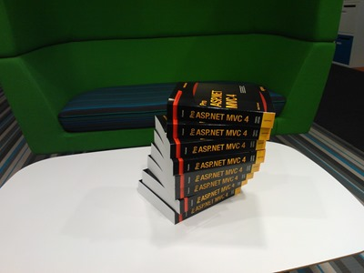

Over the past few months I've been locked away in a dark cellar working on a small MVC 4 project called [ZipApp](http://zipapp.co.uk). It's a basic Windows 8 app builder, for me one of the highlights of the project was using some of the new MVC features in anger. The last full-time project I worked on was MVC 2 based... it's amazing to see how much has changed and matured in the past 3 or so years.

Last week, I was chatting to [Steve Sanderson](http://blog.stevensanderson.com/) and he mentioned he had some "Pro ASP.NET MVC4" books going spare and wondered if I wanted to give them to the community.

I jumped at the chance and so if you want one of the 8 copies simply tweet me&#160; <strike>@thebeebs with the hash tag #givemeABook with a link to any website you have built using .net. </strike>The Competition is now closed.

I'll send the books to the 8 best websites I see. 

P.S. You have to be a UK based developer (but the site can be from anywhere) I'll name the winners at 4pm today (Friday, 5th of April)

&#160;

The Winners were:
  > The MVC Book winners are ‏@[andiih](https://twitter.com/andiih) ‏@[steentottrup](https://twitter.com/steentottrup) ‏@[brendan_rice](https://twitter.com/brendan_rice) @[chris_neff_pgh](https://twitter.com/chris_neff_pgh) ‏@[costall](https://twitter.com/costall) ‏@[ravimotha](https://twitter.com/ravimotha) ‏@[petethedev](https://twitter.com/petethedev) ‏@[christosmatskas](https://twitter.com/christosmatskas)
>  - Martin Beeby (@thebeebs) [April 5, 2013](https://twitter.com/thebeebs/status/320190030092046338) 