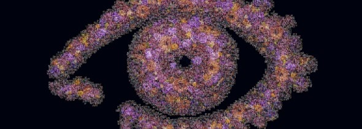
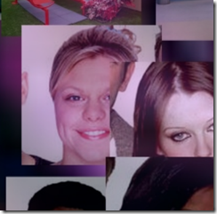
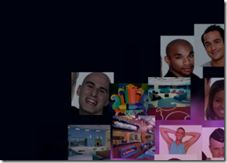
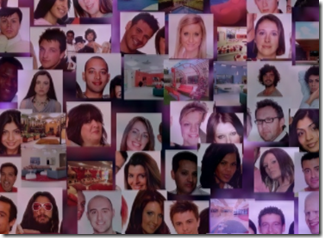
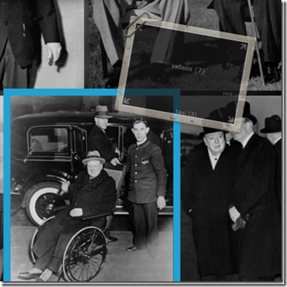
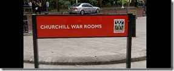
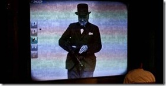

 The final series of Big brother has kicked off and whilst the latest group of 13 wannabes - including a Beyonce lookalike, a squatter who lives on discarded food, and a double amputee - enter the house, [Shoothill](http://www.shoothill.com/) have been busy producing a Deep Zoom of all the [Big brother contestants](http://tv.uk.msn.com/reality-tv/big-brother/big-brother-house-deep-zoom.aspx).

&#160;

Shoothill's latest project allows you to zoom into a giant image of the Big Brother eye to reveal hundreds of pictures of housemates and sets from the reality TV series. The Deep Zoom contains all of the housemates from all of the series, excluding the First. In my opinion Excluding the first series is a good thing because, Nasty Nick and the the winner of the first series Craig both have faces and personalities that were born to be ignored. If you look closely you should be able to spot the late great, princes Diana of the heat Magazine generation, Jade Goody.

&#160; 

Since the First Darwin Deep Zoom produced by Shoothill I've been watching the evolution (excuse the pun) of Shoothill's Deep Zoom's with interest. In my time at Microsoft I've seen Shoothill produce the world largest Deep Zoom for [Fauna and Flora International](http://www.fauna-flora.org/tiger_mosaic.php), a stunning history of [Winston Churchill](http://1940.iwm.org.uk/?page_id=527) and now the latest [big brother Deep Zoom](http://tv.uk.msn.com/reality-tv/big-brother/big-brother-house-deep-zoom.aspx).

&#160;

With every new Zoom comes an advancement each with it's own subtle twist. Shoothill don't use the standard [Deep Zoom composer](http://www.microsoft.com/downloads/details.aspx?FamilyID=457B17B7-52BF-4BDA-87A3-FA8A4673F8BF&displaylang=en) instead they use a custom process to create the DZI file used by the Silverlight control. They stitch together the various images subtly changing the hue and opacity of each image to create a mosaic of the larger image. Using their customised process they are able to create much larger Deep Zooms than is possible with the [Deep Zoom Composer](http://www.microsoft.com/downloads/details.aspx?FamilyID=457B17B7-52BF-4BDA-87A3-FA8A4673F8BF&displaylang=en). They are also able to have much more granular control over the Deep Zoom and through the numerous projects have delivered a number of rather interesting features.

&#160;

## Masking

The Big Brother logo contains a lot of black, this creates a problem because if you darken an image to achieve a black spot on the mosaic then when you Zoom into the image it will be too dark to distinguish what's in the image . To solve the problem Shoothill masked sections of the base image and modified their software to avoid placement of images in these masked areas.

&#160;

 

&#160;

## Offsetting

In both the the [Fauna and Flora International](http://www.fauna-flora.org/tiger_mosaic.php) project and the Big Brother Project they offset the images slightly so that they do not line up perfectly, this allows a small section of the base image to shine through the mosaic and produces a clearer image at higher zoom levels it also gives the impression that the pictures are random or being loaded on demand.

&#160;

The being loaded on demand effect is subtle but if you Zoom in and out you will see that the images move ever so slightly, this is intended to give an impression that the images are being stitched together on the fly - which of course they aren't -&#160; all of the Shoothill's Zooms are precompiled and that's purely because of the size of the some of the Images; which brings me to my next observation. 

&#160; 

## Large Images

The big brother image in total is around 1/2gb of imagery but&#160; the [Fauna and Flora International](http://www.fauna-flora.org/) Zoom contains around 18 gigabytes of imagery, in fact it remains the largest Deep Zoom ever produced. Support for extremely large images is important with these Mosaics as the clarity of the image improves with the more images you add; when I first Saw the Zoomed out version of the [Tiger](http://www.fauna-flora.org/tiger_mosaic.php) I Had no idea it was made up of other images.

&#160;

## Tag Clouds

The Churchill is my personal favourite of all of the Shoothill projects. The software they have used to generate the Deep Zoom rather cleverly tags each Photograph. As the user gains focus on an image a tag cloud appears on the top left hand corner which enables the user to explore other similar images which have the same tag.

&#160;

 

I was also intrigued to discover that this application now lives inside the Churchill War Rooms in London's Whitehall as an exhibit which I think makes it the first Silverlight museum exhibit anywhere in the world. The exhibit can be controlled by visitors using a roller ball that's provided in front of a huge projector screen.

&#160;

 

&#160; 

Apparently to convert the web project into an exhibit required only minor changes to ensure the project was only ever made full screen and to remove right click and the tag cloud operations.

&#160;

I'm looking forward to see what the Shoothill team get up to next, I have it on rather good authority that they have something rather big on the horizon that I'll hopefully be able to cover in the next few weeks.

&#160;

Happy Hacking

Martin