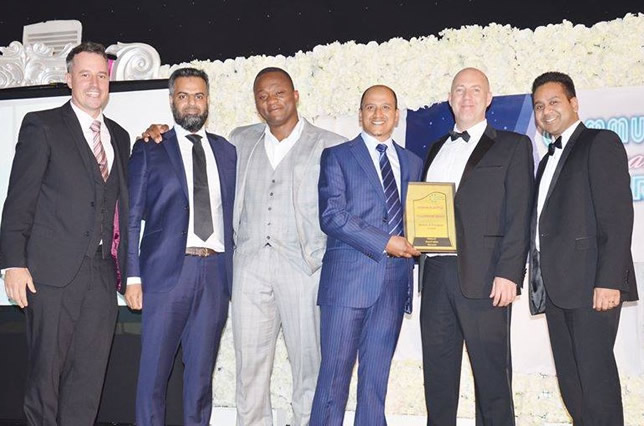

Last Night I attended the Community Inspiration Awards in Birmingham along with some of the Microsoft BAME organisers and volunteers Shorof, Zia, Raymond, and Deepam.
Microsoft was shortlisted for an award for its BAME student day event. We sadly didn’t win but were recognised as finalists and given a rather lovely certificate.

As for my part in BAME I gave a talk at this year’s BAME Student day and judged the student teams that competed to produce an app. I’ve also offered my services to help with organisation and logistics in the future.

Now the elephant in the room of course is that I am not Black, Asian, Ethnic nor am I a minority. I’m actually pretty much as far away from that as possible, but I often speak to young people about how to get a job at a tech company and it’s with that idea that I put forward my talk. 

Secondarily, I also think, particularly in my area of the business that we have an issue attracting talent from diverse backgrounds. I’m hoping that being involved with BAME and helping out with the organisation and logistics that maybe I can somehow improve my own understanding of the issues at play.

In the talk, I spoke about my background a little. I come from a working-class background and was brought up on a council estate in Corby. The expectation for me was clear, at best I was expected to be a plumber, I didn’t think it was possible to get a Job at Microsoft. 

I talk about my journey and how gradually I unpicked the expectations of my beginnings and discovered how to build technology products that spoke for themselves and through that how I built my own self confidence into the bubbling ego that you see before you today.

I wish at age 16 someone told me what I know now. There are so many opportunities, free training, schemes, apprentices and people just willing to help. The issue I see and have experienced is there is a huge disconnect between the opportunities and the people that would benefit most from them the most. 

I hope in some small way I can help change that or at least understand the issues more deeply.
