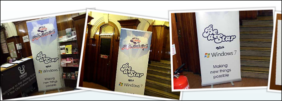

<iframe class="youtube-player" title="YouTube video player" height="345" src="images/KhJz2LmvWEg?rel=0" frameborder="0" width="560" type="text/html" allowfullscreen="allowfullscreen"></iframe>

&#160;

Displaying pictures in a gallery is something that so easy to do with one of the many jQuery Plugins, but what if you want to use the HTML5 canvas tag?

Capital FM recently created a HTML5 showcase page called [Be A Star](http://promo.musicradio.com/jingle-bell-ball-2010/audition-videos/behind-the-scenes/) and at the bottom they show off a rather fancy image gallery. The gallery uses HTML5 canvas and below I'm going to show how you can create something like this yourself.

The canvas tag is like a bitmap, once we draw an image on the canvas we can't go back and query that image to obtain it's properties. Unlike DOM objects we can not simply animate them by altering their x and y coordinates. To animate using the canvas tag you create a loop and then 24 times per second (actually how often you like) you redraw the entire canvas.

If you want to animate an image it's up to you to hold a reference to that image and then redraw the image by placing it in a different position on the canvas on every tick of the loop.

Because this is so complicated I'm going to use a nice little library called [Easel.js](http://easeljs.com/).&#160; The Easel JavaScript library provides a full, hierarchical display list, a core interaction model, and helper classes to make working with Canvas much easier.

To use [Easel.js](http://easeljs.com/). in a page you will need to download the library from [easeljs.com](http://easeljs.com/) and then add the following scripts to the header of the document. 
  
<pre style=" width: 460px; height: 190px;background-color:White;overflow: auto;">
<!--

code highlighting produced by Actipro CodeHighlighter (freeware)
http://www.CodeHighlighter.com/

--><script src="../easeljs/utils/UID.js"></script>
<script src="../easeljs/utils/SpriteSheetUtils.js"></script>
<script src="../easeljs/display/SpriteSheet.js"></script>
<script src="../easeljs/display/Shadow.js"></script>
<script src="../easeljs/display/DisplayObject.js"></script>
<script src="../easeljs/display/Container.js"></script>
<script src="../easeljs/display/Stage.js"></script>
<script src="../easeljs/display/Bitmap.js"></script>
<script src="../easeljs/display/BitmapSequence.js"></script>
<script src="../easeljs/utils/Tick.js"></script></!--

code>
</pre><!-- Code inserted with Steve Dunn's Windows Live Writer Code Formatter Plugin.  http://dunnhq.com --></!-->

Next you will need to add a canvas element to the document

<pre style=" width: 460px; height: 73px;background-color:White;overflow: auto;">
<!--

code highlighting produced by Actipro CodeHighlighter (freeware)
http://www.CodeHighlighter.com/

--><body onload="init()">  
        <canvas id="testCanvas" width="980" height="580"></canvas>
</body></!--

code>
</pre><!-- Code inserted with Steve Dunn's Windows Live Writer Code Formatter Plugin.  http://dunnhq.com --></!-->

You will also need to set the **onload** property of the body tag so that it will call a JavaScript function called **init** when the page loads.

Next we add the **init** function to the page.

<pre style=" width: 460px; height: 309px;background-color:White;overflow: auto;">
<!--

code highlighting produced by Actipro CodeHighlighter (freeware)
http://www.CodeHighlighter.com/

-->var canvas;
var stage;
var pictures = new Array(5);
var imageCount = 0;

function init() {
    canvas = document.getElementById("testCanvas");
    canvas.onmousemove = onMouseMove;
    stage = new Stage(canvas);

    for (i = 0; i <= pictures.length - 1; i++) {
        pictures[i] = new Image();
        pictures[i].src = "img/2.jpg";
        pictures[i].onload = imageLoaded;
    }
    Tick.addListener(window);
}</!--

code>
</pre><!-- Code inserted with Steve Dunn's Windows Live Writer Code Formatter Plugin.  http://dunnhq.com --></!-->

Firstly in the function we will set a global variable called canvas and populate it with the the canvas element that's on the page. We have declared the canvas variable just outside and above the **init** function.

Next we will attach the canvas elements **onmousemove** event to a new function called **onMouseMove** . We will create this function later and it will enable us to determine where the mouse is on the canvas and animate the picture gallery accordingly.

Next we populate the stage variable with a new **Stage** object. The stage object is part of the [Easel.js](http://easeljs.com/) library and is used to keep track of all of the objects that will be drawn on the canvas.

Next I have added a for loop that adds a number of images to an array called **pictures**. If you were doing this for real you would add your pictures here rather than adding a number of dummy images.

Finally I've added a listener to the **Tick** object. The tick object is part of the Easel library and provides a heartbeat to the project. On every beat of this heartbeat the library will&#160; fire the function on the page called Tick.

Now you may have noticed that every time I have added a picture to the array I set the **onload** event of the image to a function called **imageLoaded**. When the image has successfully loaded this function is called. This is a mechanism to preload the images before attempting to add them to the canvas. 

The function **imageLoaded** is called by each image. When a new image loads it increments the **imageCount** variable. When the **imageCount** variable is equal to the number of pictures we then call the function **createBitMaps**. The **imageLoaded** function ensures that all of our images are preloaded before we go to the **createBitMaps** function

<pre style=" width: 460px; height: 124px;background-color:White;overflow: auto;">
<!--

code highlighting produced by Actipro CodeHighlighter (freeware)
http://www.CodeHighlighter.com/

-->function imageLoaded() {
    imageCount++;
    if (imageCount >= pictures.length) {
        createBitMaps();
    }
}</!--

code>
</pre><!-- Code inserted with Steve Dunn's Windows Live Writer Code Formatter Plugin.  http://dunnhq.com --></!-->

In the **createBitMaps** function we loop through each image and create a new bitmap. This bitmap is then added to to the **stage** object.

<pre style=" width: 460px; height: 214px;background-color:White;overflow: auto;">
<!--

code highlighting produced by Actipro CodeHighlighter (freeware)
http://www.CodeHighlighter.com/

-->function createBitMaps() {
    var bitmap;
    for (i = 0; i <= pictures.length - 1; i++) {
        bitmap = new Bitmap(pictures[i]);
        bitmap.x = 250 * i;
        bitmap.y = canvas.height / 2;
        bitmap.rotation = 45 * Math.random() ' 0;
        stage.addChild(bitmap);
    }

}</!--

code>
</pre><!-- Code inserted with Steve Dunn's Windows Live Writer Code Formatter Plugin.  http://dunnhq.com --></!-->

First we create a new **BitMap** object then we set the x property of the bitmap. This is the horizontal co-ordinate that the image will have on the canvas.

For simplicity I have, in this loop, multiplied 250 by the loop counter and used this to set the **x** property, which will in-effect, lay the images out horizontally with a 250 pixel space between each image.

Next I have set the **y** property which is the vertical position of the image on the canvas and set it to be half the height of the canvas. This will put all of the images in the middle of the canvas.

I have then set the **rotation** property to a number between 0 and 45. This will insure that the images are randomly rotated between 0 and 45 degrees when the are drawn on the canvas.

Lastly I add the bitmap objet as a child of the stage object.

Now if we run the project nothing will happen and we will end up with a white screen. You see to get the **stage** object to draw its objects to the canvas we will need to add a function called **tick**. This function is called by the **Tick** object that we set up earlier.

It's important at the end of the this function to fire the **stage.tick** function.

<pre style=" width: 460px; height: 70px;background-color:White;overflow: auto;">
<!--

code highlighting produced by Actipro CodeHighlighter (freeware)
http://www.CodeHighlighter.com/

-->function tick() {
   stage.tick();
}</!--

code>
</pre><!-- Code inserted with Steve Dunn's Windows Live Writer Code Formatter Plugin.  http://dunnhq.com --></!-->

We should now see the images have appeared as expected on the canvas. However, when we move our mouse from left to right nothing happens as we haven't told the **onMouseMoveEvent**&#160; to do anything. 

<pre style=" width: 460px; height: 250px;background-color:White;overflow: auto;">
<!--

code highlighting produced by Actipro CodeHighlighter (freeware)
http://www.CodeHighlighter.com/

-->function tick() {
    var direction = -(stage.mouseX - (canvas.width /2)) / ((canvas.width / 2)/ 10)
    for (i = 0; i <= pictures.length - 1; i++) {
        stage.children[i].x = stage.children[i].x + direction;
    }
    stage.tick();
}

function onMouseMove(e) {
    if (!e) { var e = window.event; }
    stage.mouseX = e.pageX - canvas.offsetLeft;
    stage.mouseY = e.pageY - canvas.offsetTop;
}</!--

code>
</pre><!-- Code inserted with Steve Dunn's Windows Live Writer Code Formatter Plugin.  http://dunnhq.com --></!-->

Basically what I'm doing&#160; above is determining a direction based upon how far left or how far right the mouse is positioned on the screen (Feel free to show me a better way to do this in the comments). This direction number will be either positive or negative.

In the **onMouseMove** function I am determining the **mouseX** and **mouseY** co-ordinates which I use in the tick function.

Once I have a direction setting I update the x position of all the images that are children of the stage. As I am doing this inside the tick loop this will give the effect of the images moving.

When we start the browser we should see that now as we move the mouse left and right the images move along with the mouse. 

That's as far as am going to go with this this demo for now, I might revisit it at a later stage to clean up the JavaScript and add some of the the other effects that are used by capitalFM. 