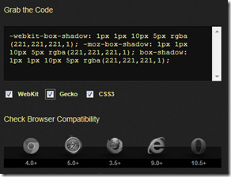
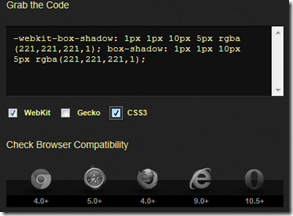

Chris Coyier tweeted last night about a CSS3 tool called box-shadow.info. 
  > If you're gonna make a CSS3 helper app thingy, do like [box-shadow.info](https://t.co/n1ACopMS "http://box-shadow.info/") and help people understand prefixes/compatibility.
>  - Chris Coyier (@chriscoyier) [March 5, 2012](https://twitter.com/chriscoyier/status/176752794685014016)   

It's a great tool but what I love about it isn't the the tool itself its the way that it explains how vendor prefixes and compatibility work.

For example if you untick the Gecko vendor prefix (-moz) then the code is removed and the browser compatibility changes Firefox from 3.5+ to 4.0+

What does this mean? Well it means at version 4 of Firefox, they stopped requiring the vendor prefix. 

If you switch off -webkit then it changes the compatibility of Chrome from 4.0+ to 10.0+.

# # So what?

I think this tool gives people a better understanding of how vendor prefixes work and the various differences between prefixes and browser versions.

As Chris suggests I think it would be great if people creating code generators like this would take time to explain the impact that vendor prefixes have. #HighFive [http://box-shadow.info](http://box-shadow.info/")

If you have no idea what vendor prefixes are take a look at [this article I wrote on the subject](http://blogs.msdn.com/b/thebeebs/archive/2012/02/20/are-you-developing-for-all-browsers-or-just-your-favourite.aspx).