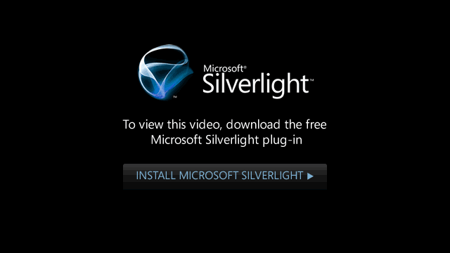

I&rsquo;ve been heavily involved with cloud development recently, particularly Azure. I used the Azure platform to put the [Tech.Days](http://www.microsoft.com/uk/techdays) website live and I learnt a great deal in that process.
The following two videos from the the Tech.Days event are great ones to watch if you&rsquo;re new to Azure.

The first from Bert Craven explains some of the advantages of moving to Azure.

<object type="application/x-silverlight-2" data="data:application/x-silverlight-2," width="639" height="360"><param name="source" value="http://www.microsoft.com/showcase/silverlight/player/1/player-en.xap"><param name="initParams" value="Culture=en-GB,Uuid=a65a8b27-d279-4418-b332-1b8cefc2818b,Autoplay=False,ShowMarketingOverlay=true,MiscControls=FullScreen;Detached,ShowMenu=True,Tabs=Embed;Email;Share;Info,ShowCaption=false,VideoUrl=http://www.microsoft.com/showcase/en/gb/details/a65a8b27-d279-4418-b332-1b8cefc2818b,Mode=Player"><param name="enableHtmlAccess" value="true"><param name="allowHtmlPopupwindow" value="true"><param name="background" value="#FF000000"><param name="minRuntimeVersion" value="4.0.50401.0"><param name="autoUpgrade" value="true">

[View this video as a WMV](mms://msnvidweb.wmod.msecnd.net/a10026/e1/ds/en-gb/CMG_UK/ENGB_Microsoft/93c6080c-144c-4ef9-9187-19b95379c6f0.wmv)
<noscript>

</noscript></object>
");
</script>

The second from Rob Blackwell, share some great tips that I found really useful. Particularly when he talks towards the end about installing non Microsoft Technologies. Basically if you can get it to run on windows, you can get it to run in Azure.

<object type="application/x-silverlight-2" data="data:application/x-silverlight-2," width="639" height="360"><param name="source" value="http://www.microsoft.com/showcase/silverlight/player/1/player-en.xap"><param name="initParams" value="Culture=en-GB,Uuid=78a2caf4-252f-4a81-9071-3c307b74ffe8,Autoplay=False,ShowMarketingOverlay=true,MiscControls=FullScreen;Detached,ShowMenu=True,Tabs=Embed;Email;Share;Info,ShowCaption=false,VideoUrl=http://www.microsoft.com/showcase/en/gb/details/78a2caf4-252f-4a81-9071-3c307b74ffe8,Mode=Player"><param name="enableHtmlAccess" value="true"><param name="allowHtmlPopupwindow" value="true"><param name="background" value="#FF000000"><param name="minRuntimeVersion" value="4.0.50401.0"><param></object>

