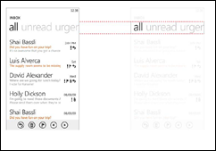
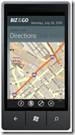
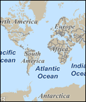
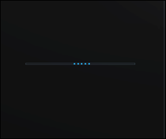
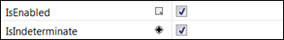
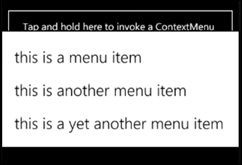
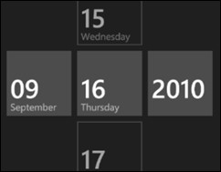
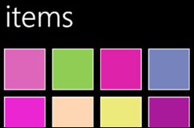

The final version of the Windows Phone developer tools were released today you can download them [here](http://go.microsoft.com/fwlink/?LinkId=185584):

You will notice that some of the controls that were missing from the last release are now included:
  <table border="0" cellspacing="0" cellpadding="2" width="572"><tbody>     <tr>       <td valign="top" width="248">         

[![clip_image001[5]](images/2117.clip_image0015_thumb_134E2BC1.png "clip_image001[5]")](https://msdnshared.blob.core.windows.net/media/MSDNBlogsFS/prod.evol.blogs.msdn.com/CommunityServer.Blogs.Components.WeblogFiles/00/00/01/38/93/metablogapi/5722.clip_image0015_4CE16185.png)
       </td>        <td valign="top" width="10">&#160;</td>        <td valign="top" width="312">**Panorama**             
The panorama control allows the user to discover content by swiping through each screen. You can add as many Panorama Items (these are the pages) as you like but I would recommend having no more than 5 for performance and usability reasons. Another top tip is to align all of your content to the left with no indents... this way it will look just like the native applications on the phone. Use colour and size to give importance to items and ensure you use whitespace to let pictures and content breathe.</td>     </tr>      <tr>       <td valign="top" width="249"> </td>        <td valign="top" width="10">&#160;</td>        <td valign="top" width="312">**Pivot              
**The pivot control is a little like the panorama control but instead of showing a small portion of the next screen to signify that there is more content, the titles of the pages are displayed at the top. The user navigates by either clicking these links or swiping the screen.             
Pivots are useful in applications were you have 4 or 5 screens with a similar layouts or you want more screen real estate than the Panorama control provides.</td>     </tr>      <tr>       <td valign="top" width="250">&#160; </td>        <td valign="top" width="10">&#160;</td>        <td valign="top" width="312">**Map**             
This control was dropped from the last beta build, but it's back for the Final tools. If you need to add any mapping to your application then this control is perfect, not only has it been designed to work well with touch input on the phone but it's also really easy to add pin points, scroll to a specific locations and annotate.             
You can no longer use a bing launcher task in the phone so if you need to add mapping ability then you will need to build a solution in your app using this control.</td>     </tr>      <tr>       <td valign="top" width="250"> </td>        <td valign="top" width="10">&#160;</td>        <td valign="top" width="312">         

**Indeterminate Progress Bar (that's the dot one)**

Ok so this isn't a new control but lots of people missed this one in the beta version of the tools. 

If you don't know how long a task is going to take, rather than using the standard progress bar you can use the Indeterminate progress bar. Just use a standard progress bar and change the IsIndeterminate property to true. 
       </td>     </tr>   </tbody></table>                    

As well as the standard control set a Silverlight Toolkit for phone has also [been released](http://silverlight.codeplex.com/releases/view/52297). Below is a list of the controls included
  <table border="0" cellspacing="0" cellpadding="2" width="672"><tbody>     <tr>       <td valign="top" width="254"> </td>        <td valign="top" width="11">&#160;</td>        <td valign="top" width="405">**Toggle Switch              
**This allows you to switch something on of or off... simple huh.</td>     </tr>      <tr>       <td valign="top" width="254"> </td>        <td valign="top" width="11">&#160;</td>        <td valign="top" width="405">**Context Menu              
**Press and hold an item and these context menus can appear. This is great if you want to give the user a way to delete an item from a list.</td>     </tr>      <tr>       <td valign="top" width="254"> </td>        <td valign="top" width="11">&#160;</td>        <td valign="top" width="405">**Date picker and time picker              
**You can now give users a touch friendly way to select the date and time.</td>     </tr>      <tr>       <td valign="top" width="254"></td>        <td valign="top" width="11">&#160;</td>        <td valign="top" width="405">**Wrap Panel              
**If you need a simple way to layout images on a panorama or a picture gallery then you need the new wrap panel. </td>     </tr>   </tbody></table>            

The toolkit also includes support for better more granular gesture support... So what are you waiting for? Go build some beautiful apps for launch and make some money :)