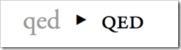

The [IE test drive website](http://ie.microsoft.com/testdrive/Graphics/OpenType/) has some new demos that show the use of [OpenType font features](http://www.w3.org/TR/css3-fonts/#propdef-font-variant-ligatures) . Over the next few weeks I thought I'd take a look at each of the different features in turn.

OpenType is a technology that is supported by IE10 and Firefox 4+ allows you to use some of the features that are stored in font files to make fonts on webpages look better, you can read more [about it here](http://blogs.msdn.com/b/ie/archive/2012/01/09/css-corner-using-the-whole-font.aspx). So on to todays topic:

# # Small Caps

Capital letters are a good way make certain things standout, however they can look out of place when they are used in conjunction with lowercase letters. Small caps are uppercase characters but are drawn to have the same height and weight as lowercase letters, this ensures they balance well with uppercase letters. Well-designed small capitals are not simply scaled-down versions of normal capitals; they are expertly created to use the same stroke weight as other letters, and a wider aspect ratio which improves readability.

If the font you are using has small caps built into the font file then you can use the following experimental code to use the feature. 

   
<pre class="brush: html;">-ms-font-feature-settings: 'smcp' 1
-moz-font-feature-settings: 'smcp=1'</pre>

Be aware that this is experimental and at this stage and it would be unwise to use this in production websites. We use vendor prefixes to convey that this feature is experimental. If you want to know more about vendor prefixes then check [this post out](http://blogs.msdn.com/b/thebeebs/archive/2012/02/20/are-you-developing-for-all-browsers-or-just-your-favourite.aspx).