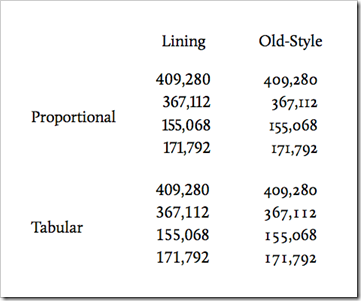

The [IE test drive website](http://ie.microsoft.com/testdrive/Graphics/OpenType/) has some new demos that show the use of [OpenType font features](http://www.w3.org/TR/css3-fonts/#propdef-font-variant-numeric) . Over the next few weeks I thought I'd take a look at each of the different features in turn.

OpenType is a technology that is supported by IE10 and Firefox 4+ allows you to use some of the features that are stored in font files to make fonts on webpages look better, you can read more [about it here](http://blogs.msdn.com/b/ie/archive/2012/01/09/css-corner-using-the-whole-font.aspx). So on to todays topic:

## Numerals

### # 

Numbers need to look different when they are used in different contexts. Some styles work in tables and charts, however the same numbers might look rigid and out of place for paragraph text. Numeral styles allow the web designer pick the right style for the right job. The example above which is taken from the [W3C site](http://www.w3.org/TR/css3-fonts/#propdef-font-variant-numeric) shows how you can use various styles to achieve text that is clearer to read and understand. Here are four of the numeral style that are included in some font.

## Lining&#160; 

Lining figures are a style of numerals where all figures are the same height and rest on the baseline.
    
<pre class="brush: html;">-moz-font-feature-settings: "lnum=1";
-ms-font-feature-settings: "lnum" 1;</pre>

## Old Style

Are numbers with varying heights. I personally quite like these numbers as it adds interest however I can imagine it might be distracting on a large report.

<pre class="brush: html;">-moz-font-feature-settings: "onum=1";
-ms-font-feature-settings: "onum" 1;</pre>

## Tabular numerals 

This is when each numeral has the same total character width. It makes it easy to compare numbers in rows.

<pre class="brush: html;">-moz-font-feature-settings: "tnum=1";
-ms-font-feature-settings: tnum" 1;</pre>

## Proportional numerals

This s how most fonts usually appear, the width of each numeral varies. Proportional figures are not intended for use in charts and tables, since they won't align vertically.

<pre class="brush: html;">-moz-font-feature-settings: "pnum=1";
-ms-font-feature-settings: pnum" 1;</pre>

Be aware that this is experimental and at this stage and it would be unwise to use this in production websites. We use vendor prefixes to convey that this feature is experimental. If you want to know more about vendor prefixes then check [this post out](http://blogs.msdn.com/b/thebeebs/archive/2012/02/20/are-you-developing-for-all-browsers-or-just-your-favourite.aspx).