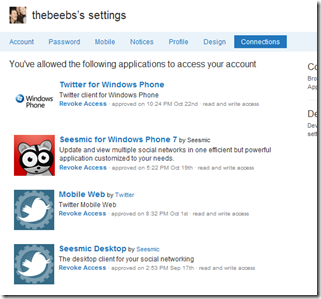

I always think its fun to take a look at the applications that you have given access to via twitter. It's in Settings>&#160; Connections.

I often don't recognise half the applications I have given access to.

&#160;

Perhaps I should be more careful, after all, if you give an application read/write access, not only can they tweet on your behalf, they can also see your private Direct Messages.

&#160;

Anyway, I'm off to do some revoking.

&#160;

