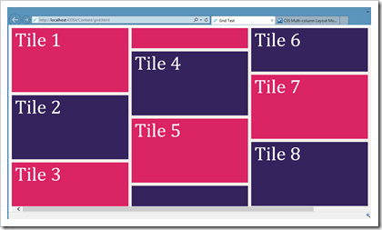
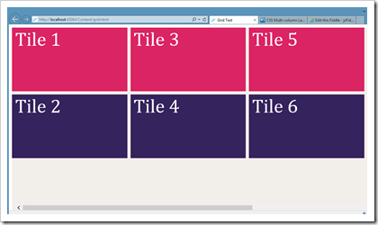

I came across a rather annoying feature today when I was trying to create a layout with [CSS3 multi column](http://www.w3.org/TR/css3-multicol/). I wanted to stack some divs on top of each other in columns.

My first attempt lead to this, which was not what I wanted:

I wanted the tile's to break to the next column&#160; if they didn't fit into the column in their entirety. It took me a while to find out what I need to do was add the following code to each div:
  
<pre name="code" class="js">break-inside:avoid;</pre>

This tell the browser to avoid breaking an element in half or as the spec puts it:&#160; "Avoid a page/column break before inside the generated box."

Code can be found here: [http://jsfiddle.net/zR2FY/](http://jsfiddle.net/zR2FY/ "http://jsfiddle.net/zR2FY/")

**Please Note: All the code is standards based (i.e. Doesn't include any vendor prefixes) At the time of writing only IE10 and Opera 12 support this unprefixed syntax, if you are using Chrome then they use a slightly different syntax and -webkit- prefixes.**