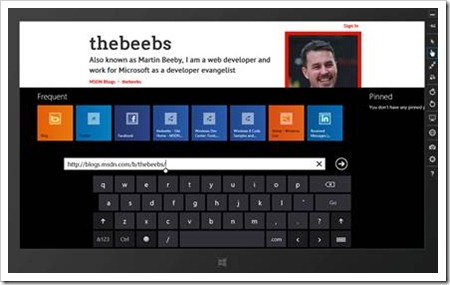

I got asked this question on email last week. The simulator, for those that don't know, is a way to test your Windows 8 application on simulated hardware. You can, for example, simulate a higher resolution or Pixel density than your actual machine. Amongst other things it also allows you to simulate touch events.

To test touch you can simply click the hand icon, the simulator will then treat click events as if they were touch events. To test the touch keyboard simply click in any test field, because you are simulating touch the on screen keyboard will appear.

