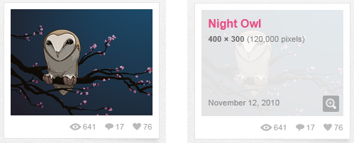

I took a look at [http://dribbble.com/](http://dribbble.com/) last night and noticed a simple yet effective treatment that they put on their pictures. If you scroll the mouse over them you get a subtle overlay fade in over the image to give you more information.

&#160;

[Click here for a demo](http://www.thebeebs.co.uk/demos/dribbble/dribbble.htm)

&#160;

# # Step 1

First we need to add a reference to jQuery 1.4.4.
  
<pre style=" width: 400px; height: 68px;background-color:White;overflow: auto;">
<!--

code highlighting produced by Actipro CodeHighlighter (freeware)
http://www.CodeHighlighter.com/

--><script src="http://ajax.microsoft.com/ajax/jquery/jquery-1.4.4.min.js" language="javascript"
        type="text/javascript"></script></!--

code>
</pre><!-- Code inserted with Steve Dunn's Windows Live Writer Code Formatter Plugin.  http://dunnhq.com --></!-->

# # Step 2

Add the HTML mark-up for the pictures. I have added a DIV with a class called poloroid (I've just realised that should have been spelt polaroid, whoops), this contains the Image, and a DIV with the class name overlay. This overlay contain 3 tags a **H2**, **H3** and a **H4** which will hold the title, information and date respectively.

<pre style=" width: 400px; height: 344px;background-color:White;overflow: auto;">
<!--

code highlighting produced by Actipro CodeHighlighter (freeware)
http://www.CodeHighlighter.com/

-->    <div class="poloroid">
        <img class="image" src="images/ballon.png" />
        <div class="overlay">
        <h2>Ballon Girl</h2>
        <h3><b>400 x 300 </b>(1200000 pixels)</h3>
        <h4>November 2010</h4>
        </div>
    </div>
    <div class="poloroid">
        <img class="image" src="images/ballon2.png" />
        <div class="overlay">
        <h2>Ballon Girl 2</h2>
        <h3><b>400 x 300 </b>(1200000 pixels)</h3>
        <h4>November 2010</h4>
        </div>
    </div></!--

code>
</pre><!-- Code inserted with Steve Dunn's Windows Live Writer Code Formatter Plugin.  http://dunnhq.com --></!-->

# # Step 3

Next up add the CSS to style the content and make it look like a polaroid. There is nothing worth mentioning here other than the fact that I gave the overlay class a z-index of 1 so that it is higher than the image.

  
<pre style=" width: 400px; height: 604px;background-color:White;overflow: auto;">
<!--

code highlighting produced by Actipro CodeHighlighter (freeware)
http://www.CodeHighlighter.com/

--></!--

code>
</pre><!-- Code inserted with Steve Dunn's Windows Live Writer Code Formatter Plugin.  http://dunnhq.com --></!-->

# # Step 4

Firstly add a&#160; jQuery ready function that will fire when the document is ready, this should call the **setUp** function.

&#160;

<pre style=" width: 400px; height: 83px;background-color:White;overflow: auto;">
<!--

code highlighting produced by Actipro CodeHighlighter (freeware)
http://www.CodeHighlighter.com/

-->$(document).ready(function () {
    setUp();
});        
</!--

code>
</pre><!-- Code inserted with Steve Dunn's Windows Live Writer Code Formatter Plugin.  http://dunnhq.com --></!-->

# # Step 5

Add the setup function, the first line of this function hides all of the objects with an overlay class. If for some reason JavaScript isn't working then the overlay will be visible over the image by default so the website will still be operational.

Next add a **mouseenter** event to all objects with the image class. We use an anonymous function which will be fired when&#160; the mouse enters the boundary of the image object. The **mouseenter** function passes over a parameter named **e**. If you check **e.srcElement** it will provide a reference to the the image object that fired the event. This is useful as we can now find the overlay object that relates to that image specifically. We do this by referencing the parent object by calling **.parent()** (which should be the DIV with the polaroid class) and then using the **.find()** method on that element to find the the child object with the **.overlay** class.

Next add a **mouseleave** event to the **.overlay** object. This will be called when the mouse leaves the boundary of the overlay object. We use the same parent trick on this element to find the overlay object (this might seem incorrect as we should have a reference to the overlay object from the e.srcElement. However, I found this buggy and this approach worked much more reliably) 

<pre style=" width: 400px; height: 265px;background-color:White;overflow: auto;">
<!--

code highlighting produced by Actipro CodeHighlighter (freeware)
http://www.CodeHighlighter.com/

-->function setUp() 
{
    $('.overlay').hide();

    $('.image').mouseenter(function (e) {
        $(e.srcElement).parent().find('.overlay').fadeTo(300, 0.95);
    });

    $('.overlay').mouseleave(function (e) {
        $(e.srcElement).parent().find('.overlay').fadeOut();
    });
}</!--

code>
</pre><!-- Code inserted with Steve Dunn's Windows Live Writer Code Formatter Plugin.  http://dunnhq.com --></!-->

In a nut shell that's it.