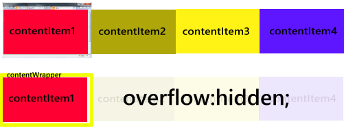
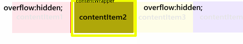
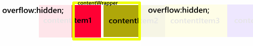
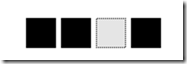

I was looking over the [.net award](http://www.thenetawards.com/) nominees this week and stumbled across the [flipboard.com](http://bit.ly/9hmoRJ) website. I loved the scrolling navigation so much I just had to open up visual studio and try and recreate it myself.
  [DemoView Demo](http://bit.ly/cZ3UMB)  

The main thing flipboard do differently is to have the logo and logo background elements move at different animation speeds from each other and the main content. This effect is is similar to [Parallex](http://en.wikipedia.org/wiki/Parallax_scrolling) scrolling and gives the website more interest, depth and flair.

I've documented the main steps to recreate my demo below:

## Step 1

First we need to make reference to the jQuery Library as we are going to use it alot. So add the following into the head of your document.
  
<pre class="brush: html;"></pre>

## Step 2

Next we will want to add our HTML to the page this HTML will hold all of the layers and links that we will need to get the example running. The logo div holds our logo image, the image I have used, like the flipboard example has a slight transparency so that we can see the background triangle shine through.

The background triangle moves at a slightly different speed to the logo and so needs it's own 
.

By wrapping all the **contentItems** in a **contentwrapper** it will make it easier to scroll the **contentItems** into view using JQuery.

I have added the nav layer and placed 4 links into it so that the user can navigate between the different **contentItems**.

Lastly I have added a button on the right of the screen so that the user can navigate the **contentItems** one at a time.

<pre class="brush: html;"><body>
    

    

    

    

    

        

            

            

        

        

            

            

        

        

            

            

        

        

            

            

        

    

    

        <ul>
            <li></li>
            <li></li>
            <li></li>
            <li></li>
        </ul>
    

    

        
    

</body></pre>

## Step 3

The first thing to do in JavaScript is to set up a few variables that we will be used later to store the width and height of the screen and the index of the current **contentItem** that is selected.

You will also need to setup the page layout when the website loads. We therefore use the **$(window).ready** event of JQuery to fire off the **sizeContent()** function that we will implement later.

When the user resizes the screen we will also need to adjust the screen layout so you will need to also set up the **$(window).resize** event to fire the **sizeContent** event.

<pre class="brush: javascript;">var theWidth;
var theHeight;
var currentContent = 0;

$(window).ready(function () {
    sizeContent();
});

$(window).resize(function () {
    sizeContent();
});</pre>

## Step 4

The **sizeContent** method does a number of things which I will go through in the next few steps. The first thing it does is capture the width and height of the browser and saves them into variables that can be used later. With jQuery it's easy to get this info by querying the: window object **$(window).width();**

<pre class="brush: javascript;">function sizeContent() {
    theWidth = $(window).width();
    theHeight = $(window).height();
    sizeContentItems();
    setLeftOnContentItems();
    sizeContentWrapper(theWidth, theHeight);
    moveContent(currentContent, theWidth);
    changeSelected(currentContent);
}</pre>

## Step 5

The **sizeContentItems** function sets the width and height of all object that have the .**contentItem** class name this will give all of the 4 content tems the same height and width as the browser. In jQuery you can select elements by using many different selectors. It's most common to select them either by id or class name but there are many other selectors that you can use [here](http://api.jquery.com/category/selectors/).

To select something by class name you use "." before the class name. To select something by ID you use "#" before the elements ID.

For Example: $(".ClassName") or $("#elementID")

Once the elements are selected you can use the** css()** function to set the width and height, like this:

<pre class="brush: javascript;">function sizeContentItems() {
    $(".contentItem").css('width', theWidth);
    $(".contentItem").css('height', theHeight);
}</pre>

## Step 6

The **setLeftonContentItems** function loops through each of the .**contentItems** and sets how far left it should be. 

We use the **[each](http://api.jquery.com/jQuery.each/)** method of jQuery to perform the loop over all element that have the class name **.contentItem.**

I have added a simple counter to the function so we know how many times we have been through the loop.

I use this counter to multiple the screen width. This is then the value that is set as the left property of the element.

Again I have used the [.css method](http://api.jquery.com/css/) of jQuery to set the elements CSS style.

<pre class="brush: javascript;">function setLeftOnContentItems() {
    var contentCount = 0;
    $(".contentItem").each(function (i) {
        contentCount += i;
        $(this).css('left', i * theWidth);
    });
}</pre>

## Step 7 

Now we have resized each of the 4 content Items to be the same width as the screen and adjusted the left value we should have 4 div elements that are side by side.

As we wrapped the **contentItems** inside the div named **contentWrapper**, if we set the width and height of the **contenWrapper** to the width and height of the screen and then set overflow:hidden in the stylesheet. Any content that overflows the **contentWrapper** will be clipped.

This will ensure that the bottom horizontal scroll bar on the browser disappears as we no longer have all of the elements visible.

To set the width and height of the **contentWrapper** use the jQuery below.

<pre class="brush: javascript;">function sizeContentWrapper(width, height) {
    $("#contentWrapper").css('width', width - 80);
    $("#contentWrapper").css('height', height);
}</pre>

To set overflow hidden add the following to the stylesheet:

<pre class="brush: html;">#contentWrapper
{
   position:absolute;
   overflow:hidden;
}</pre>

## Step 8

To have a different contentItem scroll into view we just need to set the **contentWrappers** **ScrollLeft** Property to the width of the screen multiplied by the index of the content we want to see.

<pre class="brush: javascript;">function moveContent(i, width) {
    $("#contentWrapper").scrollLeft(i * width);
}</pre>

So if we change the **scrollLeft** Property to say 1000 then the second item will now be visible and contentItem1 will be hidden by the CSS overflow:

As the size of the browser changes we need to make sure that we reset the the **scrollLeft** property otherwise we may end stuck between 2 of the content items. This is why the **moveContent** function is called by the **sizeContent** function.

## Step 9

The last function we call in the **sizeContent** function is **changeSelected**. This makes sure that the 4 navigation links at the bottom of the screen have the correct element highlighted depending on which **contentItem** we are viewing.

For example the image below shows what it would look like if **contentItem3** is selected. 

&#160;

To do this we have 3 CSS states:

<pre class="brush: html;">#nav ul li a
{
    position: relative;
    top: 0px;
    margin-right: 5px;
    background-color: Black;
    background-repeat: no-repeat;
    width: 30px;
    height: 30px;
    display: block;
}

# nav ul li a:hover
{
    background-color: #e1e1e1;
}

# nav ul li .selected
{
    background-color: #e5e5e5;
}</pre>

1.  The first state describes the unselected state of the navigation link.
2.  We then have a hover state which will appear if the item is hovered over.
3.  We then have a selected state which will be applied if the item has a selected class.

I have used background-colours but you could use background-images if you wanted more fancy buttons (like the ones on the flipboard website).

To achieve the effect all we need to do is remove the selected class from all elements and then apply the selected class to the one that we want to highlight.

To remove the class, you can use jQuery to select all the elements that have the .selectedClass and the remove the selected class from those elements.

To add the selected class we take the index on the selected content and then find the <li> that has the same index. You can select an element by index in jQuery by using the eq(x) selector. 

So if I wanted to select the 3rd <li> tag then I would use the following code: **$("li:eq(2)")** Remember JavaScript uses zero based arrays that's why we use 2 and not 3.

<pre class="brush: javascript;">function changeSelected(i) {
    $(".selected").removeClass("selected");
    $("li:eq(" + i + ") a").addClass("selected");
}</pre>

## Step 10

Now we have the basics set up we need to wire up the bottom navigation links. For this we need to add an **onclick** property to the **href** tag.&#160; 

<pre class="brush: html;"><li></li>
<li></li>
<li></li>
<li></li></pre>

We then need to create the function **scrollContent**.

<pre class="brush: javascript;">function scrollContent(i) {
    i = checkMax(i);
    scrollLogo(i);
    scrollTriangle(i);
    changeSelected(i)
    currentContent = i;
    $("#contentWrapper").animate({ scrollLeft: i * theWidth }, 1000);
}</pre>

Firstly this calls **checkMax** which I will&#160; talk about in step 12, it then scrolls the triangle and the logo. I'll deal with these two in step 11. 

The main purpose of this function is to animate the piece of content into view. Again we alter the **ScrollLeft** Property but to make it more slick we use the the jQuery animate function. This will gradually scroll the content into view, the animate function can animate all sorts of properties, you could use a plugin [like this](http://flesler.blogspot.com/2007/10/jqueryscrollto.html) to achieve this effect but I prefer doing it using jQuery alone.

The `.animate()` method allows us to create animation effects on any numeric CSS property. You can find out more about it's [usage here.](http://api.jquery.com/animate/)

<pre class="brush: javascript;">function scrollContent(i) {
    i = checkMax(i);
    scrollLogo(i);
    scrollTriangle(i);
    changeSelected(i)
    currentContent = i;
    $("#contentWrapper").animate({ scrollLeft: i * theWidth }, 1000);
}</pre>

## Step 11

We need to scroll the Logo and triangle separately from the content items. For this we don't need any complicated wrappers. Instead we just animate the left property, Both animations take 1000 milliseconds but because they travel different distances they move at different speeds, which gives that nice parallax scrolling effect.

<pre class="brush: javascript;">function scrollLogo(i) {
    var left = (i * -200) + 20;
    $("#logo").animate({ left: left }, 1000);
}

function scrollTriangle(i) {
    var left = (i * -300);
    $("#triangle").animate({ left: left }, 1000);
}</pre>

## Step 12

To wire up the next button on the right of the screen we need to add the function scrollContentNext() to the onClick event of the <a> tag. 

<pre class="brush: html;">

    

</pre>

Next we need to add the JavaScript function that actually handles it, all this does is takes the currentContent number and adds 1 to it than passes it to the **scrollContent** function.

<pre class="brush: javascript;">function scrollContentNext() {
    scrollContent(currentContent + 1);
}</pre>

As I mentioned earlier in step 10 **scrollContent** calls the function **checkMax**. This function just checks that we don't try and scroll to some content that doesn't exist. We check the maximum elements by counting the number of <li> tags on the page. If you were using this code for real you might want to alter this to only count <li> tags that are in #nav div. Alternatively you could count the number of elements with the **.contentItem** class.

<pre class="brush: javascript;">function checkMax(i) { 
var maxItems = $("li").length; 
	if (i >= maxItems) { 
			return 0; 
			} 
return i; 
}
</pre>

## Step 13

Lastly you will want to include the CSS stuff which I won't explain toady, but which is vitally important for the code to work:

<pre class="brush: html;">body
{
    margin: 0px;
    padding: 0px;
}

# logo
{
    position: absolute;
    top: 10px;
    left: 10px;
    top: 10px;
    height: 200;
    width: 160px;
    background-image:url('images/logo.png');
    z-index: 2;
}

# triangle
{
    z-index: 1;
    position: absolute;
    top: 0px;
    left: 0px;
    top: 0px;
    height: 400px;
    width: 750px;
    background-image:url('images/triangle.png');
}

# nav
{
    position: absolute;
    bottom: 10px;
    width: 300px;
    height: 20px;
    left: 40%;
}

# nav ul
{
    position: absolute;
    bottom: 10px;
    width: 300px;
    height: 20px;
    clear: both;
    display: block;
    list-style-type: none;
    list-style-position: outside;
    list-style-image: none;
}

# nav ul li
{
    float: left;
}

# nav ul li a
{
    position: relative;
    top: 0px;
    margin-right: 5px;
    background-color: Black;
    background-repeat: no-repeat;
    width: 30px;
    height: 30px;
    display: block;
}

# nav ul li a:hover
{
    background-color: #e1e1e1;
}

# nav ul li .selected
{
    background-color: #e5e5e5;
}

# rightButton
{
    position:absolute;
    width:80px;
    right:0px;
    height:100%;
    z-index:3;
}
# rightButton a
{
    position:absolute;
    top:40%;
    width:80px;
    height:80px;
    background-image:url('images/button.png');
    display:block;
}

# contentWrapper
{
   position:absolute;
   overflow:hidden;
}
.contentItem
{
    position: absolute;
    background-color: #fff;
}

# contentPicture1
{
    position:relative;
    top:30%;
    left:30%;
    width:550px;
    height:550px;
    background-color:#fff;
    background-image:url('images/content1.png');
}
# contentPicture2
{
    position:relative;
    top:30%;
    left:30%;
    width:550px;
    height:550px;
    background-color:#fff;
    background-image:url('images/content2.png');
}
# contentPicture3
{
    position:relative;
    top:30%;
    left:30%;
    width:550px;
    height:550px;
    background-color:#fff;
    background-image:url('images/content3.png');
}
# contentPicture4
{
   position:relative;
    top:30%;
    left:30%;
    width:550px;
    height:550px;
    background-color:#fff;
    background-image:url('images/content4.png');
}</pre>
