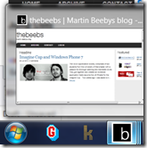

 

Wow the [Internet Explorer 9 beta](http://bit.ly/dAVoR8) launch was a whirlwind, I knew that we were working with the [Gorillaz](http://bit.ly/agEavO) and the [BBC](http://www.beautyoftheweb.co.uk/topgear/) but I had no idea about [Facebook](http://www.beautyoftheweb.com/#/experience/facebook), [the killers](http://www.beautyoftheweb.com/#/experience/killers), [LinkedIn](http://www.beautyoftheweb.com/#/experience/linkedin), [twitter](http://www.beautyoftheweb.com/#/experience/twitter), [MySpace](http://www.beautyoftheweb.com/#/experience/myspace) or any of the other [launch partners](http://www.beautyoftheweb.com/#/experience).

The Gorillaz partnership has resulted in a [web experience](http://bit.ly/bdeGeN) that highlights a number of IE9 and HTML5 features and it was great to be involved in the project and watch the Gorilaz team put the site together. I didn't have a great deal of input but I like to think that it was my presence at one of the meetings that inspired the little Joke about Evangelists at 6:05 seconds into the [demo video](http://bit.ly/agEavO).

During the next 5 days I'm going to write blogs on Pinning and JumpLists, HTML5 Canvas, IE9 peek with button support and HTML5 video, inspired by the work that the Gorillaz have done.

First things first though, I'm going to show you how you can add pinning and JumpLists to your blog or website just like the Gorillaz have. 

 

I managed to add JumpLists and pinning to my blog [thewayithink.co.uk](http://www.thewayithink.co.uk) and I've detailed below how I did it.

**Enabling Pinning**

To enable pinning you don't need to do anything. Anyone can use IE9 to pin your website to their task bar. All they do is drag the favicon from the browser address bar onto the taskbar. However, the default experience can be improved by making a few simple changes to your site.

**Create a High Definition Favicon**

Standard favicon files are usually 32x32 or 16x16 pixels in size. These look great in the browser but when you pin it to the taskbar it can be a little small and pixilated. 

To give the best pinning experience you should use a 64x64 favicon. I used [http://www.favicon.co.uk/](http://www.favicon.co.uk/) to create a 64 x 64 icon file and then uploaded it to my site.

You then need to make sure you are using the new favicon by checking the&#160; <link rel="Shortcut Icon"> tag is pointing at the new 64x64 fav.ico file, an example of the tag you should look for is below:
  <pre class="csharpcode"> </pre>

Favicons are often cached so you might need to clear out your browser cache, however, once the icon is correctly linked you will now see a better looking icon when you drag the icon from the address bar onto the taskbar.

  

**JumpLists**

In windows 7 a JumpList is a list of actions that are displayed when you right click an Icon on your taskbar. These JumpLists have been available to native application developers for a long time but IE9 beta is the first browser that exposes them for use by web developers.

Now if we want to add Jump list commands we need to add a few meta Tags:

<pre style=" width: 554px; height: 111px;background-color:White;overflow: auto;">
<!--

code highlighting produced by Actipro CodeHighlighter (freeware)
http://www.CodeHighlighter.com/

--><meta name="application-name" content="Martin Beeby's Blog" />
<meta name="msapplication-task" content="name=Archive;action-uri=http://www.thewayithink.co.uk/archive.aspx;icon-uri=http://www.thewayithink.co.uk//themes/arthemia/images/favicon.ico" />
<meta name="msapplication-task" content="name=LinkedIn;action-uri=http://www.linkedin.com/in/thebeebs;icon-uri=http://www.linkedin.com/favicon.ico" />
<meta name="msapplication-task" content="name=Twitter;action-uri=https://twitter.com/thebeebs;icon-uri=https://twitter.com/favicon.ico" />
<meta name="msapplication-task" content="name=MSDN Blog;action-uri=http://blogs.msdn.com/b/thebeebs/;icon-uri=http://www.thewayithink.co.uk//themes/arthemia/images/favicon.ico" /></!--

code>
</pre><!-- Code inserted with Steve Dunn's Windows Live Writer Code Formatter Plugin.  http://dunnhq.com --></!-->

The first meta tag has 2 attributes, **name** and **content**. The **name** attribute should have the value** "application-name" **the content attribute should contain the name of the website as you want it to appear on the JumpList.

For each task you would like on the JumpList you need to add a meta tag. I have added 3 tasks: Archive, LinkedIn and Twitter.

Each meta tag will need 2 attributes. The **name** attribute and the **content** attribute. 

The name attribute needs to contain the value "**msapplication-task**".

In the content attribute you need to add a string value in the following format: "name={NAMEVALUEHERE};action-uri={ACTIONURLVALUE};icon-uri={ICONURLVALUE}"

Below is a list of the three values that the content string will need to contain:

*   name&#160; - Which is the name of the link that will be shown on the JumpList
*   action-uri - Is the url that the user will be sent to when they click on the JumpLIst task
*   icon-url - Is a link to a fav icon that will appear on the left hand side of the JumpList Name.

Once you create your meta tags and put them in between the <head></head> tags in your document you have successfully implemented JumpLists.

You can test it by dragging the Icon from the address bar to the taskbar and then right clicking the Icon. A JumpList should appear that will look something like this:

&#160;

That's it... add pinning and JumpLists to your site with just a few lines of HTML. If you have [Internet Explorer 9 beta](http://bit.ly/dAVoR8) you can test out the pinning and JumpList feature at my website [http://www.thewayithink.co.uk](http://www.thewayithink.co.uk), [http://gorillaz.com](http://gorillaz.com) or even [http://www.facebook.com](http://www.facebook.com)