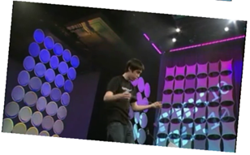

   

Ever tried to rotate the Video tag in HTML 5? Up until today I hadn't... with just pure HTML5 it turns out it's not as easy as you might think. There is however a rather cool solution to the problem thanks to a little canvas and JavaScript wizardry.

[Paul Tallet](http://blogs.msdn.com/b/ptallett/) explained the issue and his solution to it during a session he delivered about the UI challenges faced by the team that developed the [BBC Top Gear cool wall](http://topgear.cloudapp.net/default.aspx).

If you are looking for a CSS3 implementation you might want to take a look at the [CSS3 way of achieving this effect](http://blogs.msdn.com/b/thebeebs/archive/2010/11/08/how-to-rotate-a-video-using-css3.aspx).

[Click here to see the demo.](http://www.thewayithink.co.uk/html5/rotate.html)

# # Step 1

To make things a little easier add a reference to jQuery:
  
<pre class="brush: html;"></pre>

# # Step 2

Add a ready function, this will fire the setUpVideo() function when the page is loaded. Also I've added a few variables to store our objects in.

<pre class="brush: javascript;">var video;
var canvas;
var width;
var height;
var ctx;

$(document).ready(function () {
    setUpVideo();
});</pre>

# # Step 3

[When](https://msdnshared.blob.core.windows.net/media/MSDNBlogsFS/prod.evol.blogs.msdn.com/CommunityServer.Blogs.Components.WeblogFiles/00/00/01/38/93/metablogapi/3005.image_169DE164.png) the page is loaded we can load the video and the canvas objects into the variables we set up in the last step. To get a reference to the canvas so that we can draw on it we need to call getContext('2d') we can then use the traslate function to move the drawing area by 50px. Doing this ensures that when we rotate the video image it will not be clipped by the edges of the canvas.

Calling ctx.rotate(0.05) will rotate what ever we draw on the canvas. We can then set up a loop with setInterval that will call drawFrame every 100 milliseconds.

<pre class="brush: javascript;">function setUpVideo() {
    video = $("#mVideo").get(0);
    canvas = $("#mCanvas").get(0);
    width = video.width;
    height = video.height;
    ctx = canvas.getContext('2d');
    ctx.translate(50, 50);
    ctx.rotate(0.05);
    window.setInterval(drawFrame, 1000 / 24);
}</pre>

# # Step 4

The last step is to draw the video frame on the canvas. This function is called 24 times per second (1000 / 24) so should give the effect of 24fps video. Now because we rotated the canvas area each frame will be drawn rotated. This gives the effect of the video being rotated. 

<pre class="brush: javascript;">function drawFrame() {
    ctx.drawImage(video, 0, 0, width, height);
}</pre>

The effect of taking a video frame and updating the canvas could be used to produce all sorts of effects, for example we could grey scale the video or take thumbnails of the video. If you stretched this idea even further you could composite various videos together, perhaps even achieve a [green screen composite on the fly](https://developer.mozilla.org/En/Manipulating_video_using_canvas).