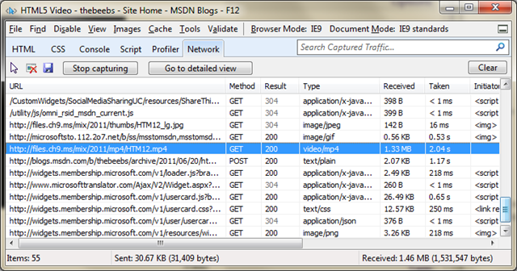
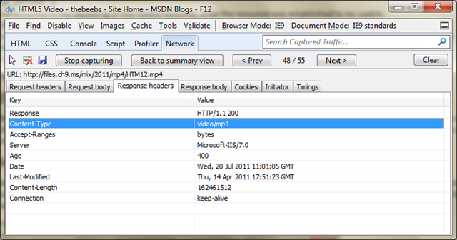

If you can't get HTML5 video to work in IE9 here is the process that I use to figure out what's wrong:

First I will load up the page and press F12 to bring up the developer tools I then pop over to the console tab in the console I get a reference to the video object using the script below (If the video element is not the first video element then you will need to adjust the array value ).
  
<pre style=" width: 605px; height: 37px;background-color:White;overflow: auto;">
<!--

Code highlighting produced by Actipro CodeHighlighter (freeware)
http://www.CodeHighlighter.com/

-->document.getElementsByTagName("video")[0].error.code
</pre><!-- Code inserted with Steve Dunn's Windows Live Writer Code Formatter Plugin.  http://dunnhq.com -->

The code that is returned let you know what's gone wrong, 

*   MEDIA_ERR_ABORTED : 1
The fetching process for the media resource was aborted by the user.*   MEDIA_ERR_DECODE : 3
An error has occurred in the decoding of the media resource, after the resource was established to be usable.*   MEDIA_ERR_NETWORK : 2
A network error has caused the user agent to stop fetching the media resource, after the resource was established to be usable*   MEDIA_ERR_SRC_NOT_SUPPORTED : 4
The media resource specified by [src](http://msdn.microsoft.com/en-us/site/ff974762) was not usable.

In IE9 if you get error code 4 then there are two common issues:

# # Incorrect Encoding

IE9 supports H.264 in an MP4 container and WebM if the user has the codec installed on their machine. To support IE9 you will need to ensure that you have correctly encoded your video. For H.264 video I use [Miro](http://www.mirovideoconverter.com/) (a .net application on windows that wraps up FFMPEG) or if I want a specific baseline or setting I use [Expression Encoder](http://www.microsoft.com/expression/products/EncoderPro_Overview.aspx).

# # Incorrect MIME Type

You need to make sure your sever returns the correct MIME type when it returns a file. If the file is MP4 then the files MIME type should be video/mp4. If you want to check the MIME type then use the F12 developer tools (press F12 in IE9) and then navigate to the Network Tab. Press Start Capturing and refresh the web site.

You will then be able to see all of the network traffic. Find the video in the list.

If you double click the list item you will go to a detailed view. Check to ensure that there is a Content Type with a value of video/mp4. If it's anything else or it doesn't exist you will need to change your server to ensure that the correct MIME type is returned.

