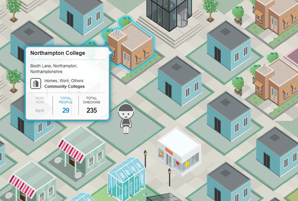

It's 00:28 and I'm up early (or late depending on how you roll) to watch the IE9 launch directly from SXSW. If you want to get your hand on IE9 you can download it [here](http://bit.ly/dAVoR8)

The Keynote had some great demos that showed off the the Speed and performance of IE9 on Windows. There was even a preview of Flash 11 which showed the new 3D capabilities of Molehill which were just mind blowing, showing that IE cares about flash developers and appreciates the massive impact their creativity has on the web.

But what I really loved was all the site demos that launched.

There was a great one from [@ZEFrank](https://twitter.com/ZEFrank) which you can see below, it's inspiring to see someone who really understands and can articulate the feeling of excitement and opportunity that building for the web delivers.

<iframe title="YouTube video player" height="370" src="images/7mwlL1VEhkk" frameborder="0" width="605" allowfullscreen="allowfullscreen"></iframe>

His HTML5 demo [http://star.me](http://star.me) is a social game, meets social network where you can reward your friends by awarding them stars. I've not played it yet myself, but the idea seems interesting.

If you don't know who ZEFrank is then make sure you watch this incredible video from his TED Talk in 2010 (the ending made _**nearly**_ me cry):

<object width="446" height="326"><param name="movie" value="images/EmbedPlayer.swf"></param><param name="allowFullScreen" value="true" /><param name="allowScriptAccess" value="always" /><param name="wmode" value="transparent"></param><param name="bgColor" value="#ffffff"></param> <param name="flashvars" value="vu=http://video.ted.com/talks/dynamic/ZeFrank_2010G-medium.flv&su=http://images.ted.com/images/ted/tedindex/embed-posters/ZeFrank-2010G.embed_thumbnail.jpg&vw=432&vh=240&ap=0&ti=981&introDuration=15330&adDuration=4000&postAdDuration=830&adKeys=talk=ze_frank_s_web_playroom;year=2010;theme=the_creative_spark;theme=what_makes_us_happy;theme=tales_of_invention;theme=whipsmart_comedy;theme=the_rise_of_collaboration;theme=media_that_matters;theme=art_unusual;event=TEDGlobal+2010;&preAdTag=tconf.ted/embed;tile=1;sz=512x288;" /><embed src="http://video.ted.com/assets/player/swf/EmbedPlayer.swf" pluginspace="http://www.macromedia.com/go/getflashplayer" type="application/x-shockwave-flash" wmode="transparent" bgColor="#ffffff" width="446" height="326" allowFullScreen="true" allowScriptAccess="always" flashvars="vu=http://video.ted.com/talks/dynamic/ZeFrank_2010G-medium.flv&su=http://images.ted.com/images/ted/tedindex/embed-posters/ZeFrank-2010G.embed_thumbnail.jpg&vw=432&vh=240&ap=0&ti=981&introDuration=15330&adDuration=4000&postAdDuration=830&adKeys=talk=ze_frank_s_web_playroom;year=2010;theme=the_creative_spark;theme=what_makes_us_happy;theme=tales_of_invention;theme=whipsmart_comedy;theme=the_rise_of_collaboration;theme=media_that_matters;theme=art_unusual;event=TEDGlobal+2010;"></embed></object>

## Mike Tompkins

If you haven't heard of [Mike Tompkins](http://www.beautyoftheweb.com/firework) then congratulations, you are getting out of the house enough. This [new site](http://www.beautyoftheweb.com/firework) lets you play with his cover of Fireworks by Katy Perry. You can mess around with the volume of all the different elements. You can also use the audio tool to create your own mini masterpiece and share it with your pals on Facebook and Twitter. 

One technical point that is worth noting, is that in the default view, there are 16 videos playing at the same time with no lag. This is only possible because of IE9 hardware acceleration. 

If you don't know who Mike Tompkins is then you should check out the video below:

<iframe title="YouTube video player" height="370" src="images/qjCLQaTFXx0" frameborder="0" width="605" allowfullscreen="allowfullscreen"></iframe>

## Foursquare

Also at the launch foursquare introduced their new HTML5&#160; experience [Foursquare Playground](http://www.foursquareplayground.com/)&#160; which gives you an interactive view of your locality. The demo showcases IE9s hardware accelerated canvas and the new GeoLocation feature, which allows the user to a give site permission to figure out their current geographical position. In the image below you can see a HTML5 version of my little part of Northampton, all the buildings represent locations in my local area and you can dive into them to find out who the mayor is.

## Kung Fu Master

Think another browser is faster than IE9? Why not test it using the new [Kung Fu Master](http://www.masterofthewebgame.com/sg/)&#160; game. The speed in this demo is Jaw dropping and It's only possible because we have unlocked the power of the PC by using Hardware acceleration.

If the sites above have inspired you to get into HTML5 why not enter out [HTML5 competition](http://ubelly.com/2011/03/dev-unplugged-a-html5-contest/)? You can find out more here. Ubelly also have a page with [HTML5 tutorials](http://ubelly.com/html5/) to help you get started.