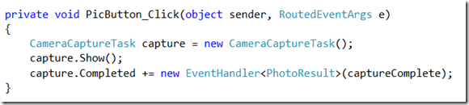
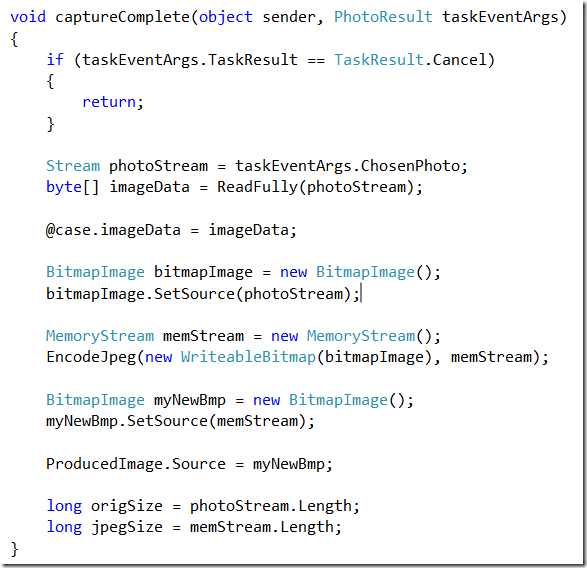

 

The Olive Appreciation Society comprises of two students from the University of Manchester with a passion for thorough planning and marinated olives. They got together and created an incredible application that's become the UK Finalist for the Imagine Cup. 

&#160;

Two weeks ago I was asked to help the guys get the Windows Phone 7 portion of their software on to a real device. I was lucky enough to catch a 15 minute demo from the guys about their application and let me tell you... the idea is incredible. Now I'm not going to go into detail about their application because you can read [more here](http://imaginecup.com/MyStuff/MyTeam.aspx?TeamId=19910) and the final presentation will be shown live on [http://imaginecup.com/](http://imaginecup.com/ "http://imaginecup.com/") but I wanted to discuss briefly how they used the Phone to capture a photograph because it's a nice quick example of how easy it is to use the Windows Phone API.

&#160;

Firstly they used the CameraCaptureTask on the button click, they then wired up the Completed Event Handler and delegated it to the captureComplete handler.

&#160; 

&#160;

In the captureComplete handler they grab a stream of the chosen photograph and load it into a BitmapImage which is then used as the source for an Image Control.

&#160;

 

&#160;

The Imagine Cup final takes place on the 8th of July in Poland. Make sure you tune into the live final at [http://imaginecup.com/](http://imaginecup.com/ "http://imaginecup.com/")