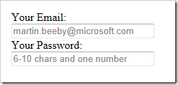

[Placeholder](http://dev.w3.org/html5/spec/Overview.html#the-placeholder-attribute) is a HTML5 attribute that you add to input elements, it makes it easier for users to fill out your forms.

[Demo view here ](http://lab.thebeebs.co.uk/placeholder/)[Source on GitHub ](https://github.com/amiel/html5support)

It works for on regular input fields but also works on on password types. Of course the [placeholder tag is not supported](http://www.caniuse.com/#search=placeholder) by every browser, but a [great polyfill](https://github.com/amiel/html5support) created by [Amiel Martin](https://github.com/amiel) exists which uses JavaScript to add support to unsupported browser.

You just need to add the scripts to your document:
  
<pre class="brush: html;">
</pre>

Add a some script to initialise the library

<pre class="brush: javascript;"> $(document).ready(function () {
            $.placeholder();
        });</pre>

Add some CSS to style the placeholder text 

<pre class="brush: html;">.placeholder
        {
            color: #888;
        }</pre>
