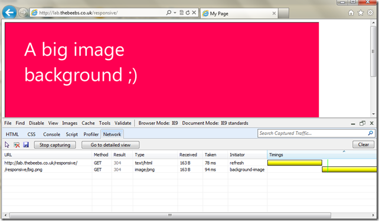
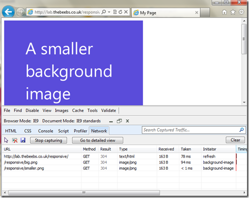

I just read a [blog post](http://www.benjaminhowarth.com/blog/2012/02/29/responsive-web-design-a-response) that stated that media Queries were not a good idea because:
  > **your entire stylesheet**, with resources, images, the works - for **all** viewports - is loaded, before the @media stuff is parsed by the browser.  

This isn't entirely true. Although all of the CSS will be downloaded, background-images will not be.

Browsers are smart enough to only load the required assets. To show this I created a [very simple sample](http://lab.thebeebs.co.uk/responsive/).
  
<pre class="brush: html;">    </pre>

If the view port is bigger than 751px then the big image is shown. If the view port is smaller than 750 the smaller image is shown.

I then open up IE9 press F12 to open the developer tools and switch to the network tab. In the network tab I hit the button "Start Capturing" I then navigate to the page. This is what I see:

You will notice that only the big.png file is loaded. As I make the window smaller than 750px the other image switches in and is loaded.

You can read more about what is and isn't downloaded by [Media Queries in this article](http://blog.assortedgarbage.com/2010/12/css3-media-queries-download-answers/), which also covers the issue display:none not stopping images downloading. 