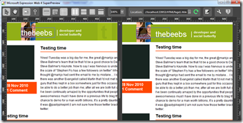

Over the weekend I have been redeveloping the skin for my website. It's not quite finished (I'm on step 4) but for those that are interested I thought I'd share my workflow with you. At work I very rarely design a website from start to finish, more often than not we hire an agency to either deliver the whole site or at least a Photoshop file that I'll then slice. 

When I'm doing something for myself, however, I don't have the luxury of a talented designer. I often compare it to home cooking, it's satisfying doing it yourself but the results are rarely as good as a restaurant can deliver.

&#160;

## Step 1&#160; -Sketch some ideas:

I like to sketch out key ideas. I sometimes sketch the whole site, sometimes i just sketch a key element. On the new site the only thing I sketched was the top bar, I tried lots of variations. Sketching is good because it's easy to change and iterate. My sketches don't look good, many of the designers I work with produces sketches that look incredible, despite this, the process of getting an idea out of your head onto paper is valuable in itself, I don't care what it looks like.

&#160;

## Step 2- Produce an image using a 960 template:

This week was the first time I used [Expression Design 4](http://www.microsoft.com/expression/products/Design_Overview.aspx) to produce a high fidelity image of the website, usually I'd have used [Adobe Fireworks](http://www.adobe.com/products/fireworks/). I love fireworks for this kind of design and I've been using it since it was made by macromedia. In terms of speed, I'm much faster in Fireworks than anything else. I used Expression as I currently don't have a fireworks licence and expression was free as part of my MSDN subscription.

After a few hours of playing around and learning I figured out how to do most things that I do in fireworks.

As a base I use [grid960](http://960.gs/) templates, you can get them for all major design packages including fireworks and expression design.

&#160;

## Step 3 - Convert Image to CSS using 960

Once I have the image of the site I will then recreate it by hand in Visual Studio. I've played around with fireworks exports, but I prefer knowing exactly how the CSS and HTML are put together. I use the [960 grid system](http://960.gs/) as a base. I have previously used, notepad and Dreamweaver. I use Visual Studio exclusively now because it's CSS and JavaScript intellisense and Debugging are better than anything else I've used before.

&#160;

## Step 4 - Fixing cross browser issues.

I develop my website so that it looks good in my default browser (currently [IE9 beta](http://windows.microsoft.com/ie9)) I will then use [Expression Web SuperPreview 4](http://www.microsoft.com/uk/expression/products/Web_Overview.aspx) to compare how it looks in Firefox, Safari, IE6, IE7, and IE8. In general I'm looking to make it look exactly the same in everything but IE6. With IE6 I'm happy once it looks readable, I don't however worry to much about it looking perfect.

&#160;

&#160;

## Step 5 - JQuery and progressive enhancement.

Next step is to add in any rollovers, animations and interactions using jQuery, I test the features and capabilities of the browser before adding anything . This means that users that browse my site using a good browser get better features.. Once that's working in my default browser I will check check manually&#160; against all other browsers.

&#160;

## Step 6 - Testing using Selenium

if I have some JavaScript doing anything a little complicated like form validation, I will write a test in [selenium](http://seleniumhq.org/) to ensure that its working well in various states and with different parameters. This also give me a chance create a test harness that I can use in the future to do regression testing.

&#160;

## Step 7 - Integrate

I'm then left to integrate the finished skin into my website, whether it be [Wordpress](http://bit.ly/gc4Eop), [Umbraco](http://bit.ly/dHoAk7) or [BlogEngine.Net](http://bit.ly/eiG1uT) (or, shock horror, one of my own creations)