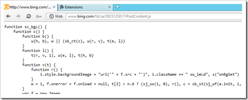

If you have viewed source on any website in the last few years then you will have certainly seen Minified JavaScript. This is JavaScript where all of the whitespace and unnecessary characters have been removed. Developers do this because it reduces the size of JavaScript files and makes sites load faster. I thought it might be a good idea to look at all the browsers and dig into the tools available to developers to reverse this process and make JavaScript more readable when debugging.

&#160; 

# # IE9

In IE9 you can un-minify JavaScript to make it more readable by using the Format JavaScript tool.

 

This expands the whitespace and formats the braces to make it more readable. All of the breakpoints you add to the code will still work and it's makes debugging production code that little bit easier.

# # Chrome

In Chrome you can press the Pretty Print Button which is at the bottom of the script Windows. It does the same job as IE9. All of your breakpoint positions will be maintained.

 

# # Firefox

As far as I know neither the default tools nor Firebug have a pretty print feature. There is however an add-on called [JavaScript Deminifier](https://addons.mozilla.org/en-US/firefox/addon/javascript-deminifier/). When you first Install the FireBug Add-on you will need to press Ctrl+/ and then click JSD Off. This toggles and switches the JavaScript Deminifier on. Unlike the previous two deminifiers this will effect every JavaScript file you download rather than just the one you are looking at.

 

# # Opera

The default dragonfly tools do not seem to have a built in feature as far as I could tell. However there is an [add on](https://addons.opera.com/en-gb/extensions/details/readable-javascript/) which enables you to view JavaScript files in the browser window. You simply navigate to a JavaScript URL, press the alert message and the file is then formatted:

 

# # Safari

In the Safari developer tools, you also have a Pretty Print button much like Google Chrome. Just click it and the JavaScript is formatted.

 

If I have missed any options or overlooked any built in tools do let me know in the comments.