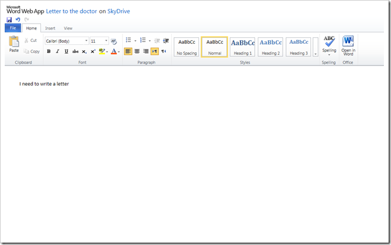
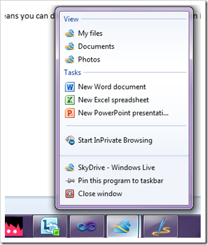

When I say to someone out side of Microsoft "Stick it on SkyDrive" they often look at me blank faced? Do you mean DropBox? Apparently the service has around 100 million users worldwide, but I don't think it's really caught on in the UK as much as it must have done else where. Which is odd considering how good a service it is. 

Basically SkyDrive gives you 25gb of online storage for files and photos and one click access to edit any files inside of office web apps. Think of it as a love child of Google Apps and DropBox and you're not far wrong.

&#160;

The office Web Apps are stunning, they have been around for a few years now and I've personally not seen any online spread sheet or word processor come close it it in terms feeling like a desktop experience. Which raises an interesting point... Should Web Applications feel like desktop applications? Is it better for a web application to feel like it's desktop counterpart or is there some inherent benefit of changing the UI so it feels more like a website?

Talking of feeling like a desktop application, the new SkyDrive also use IE9 pinning. this means you can drag the favicon to the task bar and then interact with SkyDrive from your task bar rather than going to the site via a URL. The right click menu gives you easy access to create a word, PowerPoint or Excel document or you can just view your files.

&#160;

With Windows Phone 7 the process of creating a document on any device is becoming a reality as I can create and edit documents on the phone, sync with SkyDrive edit them in the browser or even in the full blown desktop version of office. 

For me, a WP7, Hotmail and IE9 user it's a really great start-to-finish experience. The interesting thing to see is whether it will be compelling to people that don't currently use any of those services.