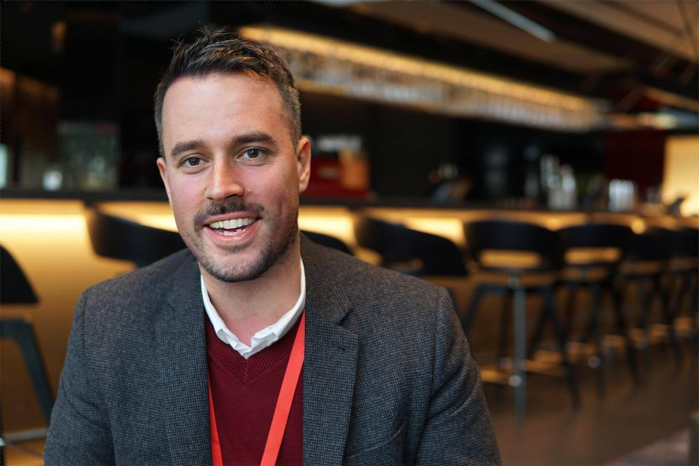

I’m happy to speak at pretty much any developer event in Europe, the Middle East or Africa. Here are a few topics that I’m talking about at the moment, 
but if you have a specific topic feel free to ask me. I can present on most Cloud, Web, JavaScript or C# topics. Contact me at martin dot beeby at oracle.com

> Martin spoke at the Hyperledger London Meetup and he was fantastic! Very experienced speaker with great ideas on how to make his talks entertaining and interactive!
>
> Marta Piekarska 
> 
> Director of Ecosystem, Hyperledger, Linux Foundation

### The State of the Function
  
There is a real buzz in the air about Functions and Serverless software development, and there is an overwhelming number of platforms offering similar but different things. In this 20-minute talk, Martin Beeby will take a look at the various platforms available, give an overview of how they work, their different approaches and talk about projects that he has built using them. 

### Using Docker Containers as Functions

The Fn project is a container native serverless platform that you can run anywhere -- any cloud or on-premise. Each function is a container which means anything that runs in a container can be a function. In this talk, we will explore how it works and how to develop an application using this very different approach to application development.

### Continous Integration and Deployment of Containerised Applications using Wercker

Containerised apps are becoming the new normal, yet it's not always apparent to how to put these applications live in a DevOps style. In this talk I will look at how I use Wercker to deploy a web app I have built.
  
### The Web on Day 10,000

It's been 9,865 days since Dec 1990 when the first website was published and changed everything. In this 45 minute talk I will pose one simple question: What will the web be like on day 10,000?

I will look at the future capabilities of browsers, devices and servers and how applications will be impacted by advances in those three areas.

Using live code and demos I will explore, amongst other things, Bots, Web Components, Web Assembly, AI, Language Understanding, Speech and Serverless application architecture.

You can see a <a href="https://www.youtube.com/watch?v=hgcrKRgFpn4">video of this talk here</a>
 
### A Developer Primer on Blockchain

Come find out how you can build a peer-to-peer distributed ledger forged by consensus. Understand through code how to create “smart contracts” and develop a different type of transactional application that establishes trust, accountability and transparency, while streamlining business processes and legal constraints.
  
### Workshop: Becoming the Dev Star.
The team at Oracle has put together this interactive workshop that I can now deliver at your company or event. If you are interested just get in contact on email martin dot beeby at oracle dot com.

In this workshop you will work together in squads to complete the mission – becoming the Dev Star. We will look at how you build Microservices and host them on the Oracle cloud.

More Information(https://thebeebs.co.uk/devstar)

## My Bio

### First Person:
I am a Developer Evangelist at Oracle. While I work across all of our technologies, my particular passion is Cloud. I regularly speak and blog about all aspects of Cloud development and implementation. I have been a developer since I was 16 and over the past 19 years have worked on projects with many Major brands. Prior to joining Oracle I worked at Microsoft as a developer and evangelist for 8 years. I’ve written articles for and featured in, NET Magazine, ZDNet, NOUPE, SitePoint, TutsPlus and Channel 9.

### Third Person Bio:
Martin Beeby is a Developer Evangelist at Oracle. Martin has been developing since he was 16 and over the past 19 years has worked on projects with many Major brands. Prior to joining Oracle Martin worked at Microsoft as a developer and evangelist for 8 years. Martin has written articles for, and been featured in, NET Magazine, ZDNet, NOUPE, SitePoint, TutsPlus and Channel 9.

### Short Bio:
Martin works for Oracle. He’s been a developer since the late 90s and loves figuring out problems and experimenting with code.

### Pictures

> Great talk this evening by @thebeebs on the .NET Compiler Platform (aka. Roslyn) at @dotnetsouthwest
> 
> Joseph Woodward 
> [@joe_mighty](https://twitter.com/joe_mighty/status/831253112488878081)

> November's meet up brought us @thebeebs and The Web on day 10,000. Nicest man alive and a great talk. 
> 
> Frontend NE 
> [@FrontendNE](https://twitter.com/FrontendNE/status/799205507722543104)

> Great talk from @thebeebs at #LinuxingInLondon
> 
> Brian Linuxing 
> [@BrianLinuxing](https://twitter.com/BrianLinuxing/status/865261746579222528)

> Big thanks to @thebeebs and @MartinKearn for coming along to talk at @ADNUGUK tonight. They shared some great information!
>
> Gary Ewan Park 
> [@gep13](https://twitter.com/gep13/status/845039417920307200)

> Great talk last night by @thebeebs Reasons to be creative 2016 - the web on day 10,000 
> 
> Brian Teeman
> [@brianteeman](https://twitter.com/brianteeman/status/830032940834906112)

> He's bloody good.
> 
> Adam Bolton, International Developers in London
> [@Adam__Bolton](https://twitter.com/Adam__Bolton/status/950474643885961216)
