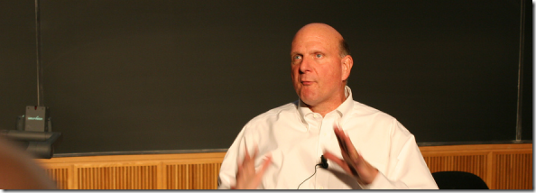

 

Yikes! Tuesday was a big day for me, the great @markjo and @markholmes some how convinced Steve Ballmer's team that be that I'd be a good choice to Demo IE9 at the UKTechdays event during Steve Ballmer's Keynote.&#160; Now to say I was Nervous is understatement. It's an understatement on the scale of&#160; "Stephen Fry has a few followers on twitter"

When I first heard that I'd be demoing I thought @markjo had sent the email to me by mistake... I looked around the office wondering if there was another Evangelist called Martin that I'd not met before. Some inflatable super demo guru that they kept in a box somewhere just for this occasion. Inflatable or not I suspected that he'd be able to do a better job than me; after all we are both full of hot air.

In my short time at Microsoft I've been continually amazed by the opportunities that people here have offered me, I mean what awesomeness must I have done in a previous life to blag this gig? Now it's not everyday I get the chance to demo for a man worth billions, It's a pretty daunting thing. I think @lukepuplett (or maybe it was @pastypikepint (I am not sure how those twitter brackets work)) put it best when he said on twitter:

**@lukepuplett: I described Steve Ballmer to my wife as a bit like seeing Optimus Prime in the flesh. #uktechdays (@pastypikepint)[http://yfrog.com/muut5ej](http://yfrog.com/muut5ej)**

Now I'd rehearsed that demo tirelessly for the last 3 days, and it went ok. I had a split second nightmare as I shook Steve's hand then went to walk behind him to get to the demo machine, only to realise that he wanted me to walk to the left of him. I somehow managed to shimmy past and finally got to safety of the demo desk. I started ok, fumbled once or twice, but ultimately I did what I needed to do and was so relieved when I could shake Steve's hand and get the hell of that stage.

Funny though as soon as its over; you're itching to get back up and do more.

So I was wondering... If you could do a demo with anyone famous: Who would it be and what would you demo?