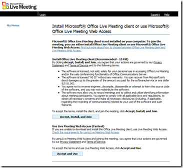
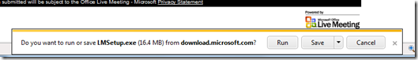
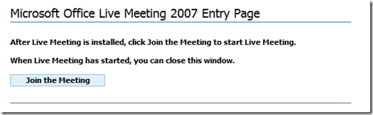
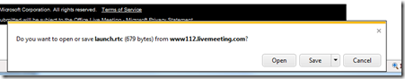
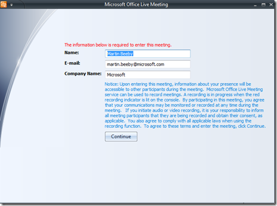
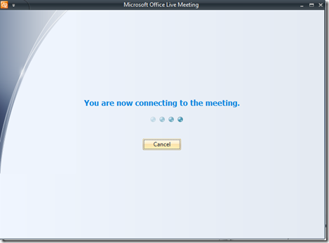

It seems our live meeting friends have a bug on their website that makes it confusing to enter a 2007 live meeting using IE9 Beta.

Every time you go to the website you are told that you must install Live Meeting 2007 Client (even if you already have it installed)

This is the solution I came too:

&#160;

*   Firstly click "Accept, Install and Join" even if you already have Live Meeting Client..  

&#160;

*   You will then see a pop up at the bottom of the screen. If you don't have live meeting, click run. If you do have live meeting click cancel.  

*   If you selected to install, wait until Live meeting is installed.
*   You can now click on Join Meeting  

&#160;

*   This will then present a message at the bottom of the screen. Click Open.  

*   You should then see the following screen. Enter your details and click continue  

*   You will then be connected to the meeting.  

Sorry for this inconvenience.&#160; If you are still having issue, I have listed some further support information:

## In Event Support:

In the LiveMeeting itself, a support member will be logged in as "Support (LM IT) and contactable via private chat if you are having any issues while viewing this Live Meeting.&#160;&#160; 

Email: [weregsup@microsoft.com](mailto:weregsup@microsoft.com) Tel: +44 (0) 870 8509442 

## Live Meeting Checklist and Tips:

Use the Microsoft [Live Meeting 2007 Windows Console Compatibility Test ](http://go.microsoft.com/fwlink/?LinkId=90703)to join a meeting to see if your computer is compatible with Live Meeting 2007. 

##### Instructions before the webcast starts

To attend a Live Meeting, you will need:

1. A computer with access to the Internet (good hardwire access recommended) to view the visual portion of the event

2. A functioning sound card and speakers or headphones for your PC

3. Windows Media Player 9 (WMP9)

4. A compatible computer configuration. **Verify Microsoft Live Meeting 2007 System Requirements**

##### Listen to the audio portion of the event

After you log in to the Live Meeting console, you will hear the event's streaming audio. If you do not have Windows Media Player (WMP) 9 or a later version installed, you will be prompted to install it.

If you have WMP 9 or a later version installed but still do not hear the audio, confirm that your PC speakers are turned on and that the volume is turned up. If you are using a headset, you need to connect it to the computer **before** opening the LiveMeeting. If you continue to experience difficulties, once you are logged into the session, please turn your seat color to the appropriate color via the drop down menu in the Seating Chart.&#160; 

Please note for this event the audio will be speaker only through the PC.&#160; You will not be able to speak as an attendee. 

## IE9 and Live Meeting:&#160; Known Issue:

If you use IE9 with Live Meeting Web Access you will very probably be asked to install the Live Meeting 2007 client. Once you have successfully done that, you will be once again asked to install the Live Meting 2007 client. It's an endless loop.

The workaround is to retrieve the following details from your meting request: 

**Meeting ID: **

**Entry Code: **

**Location **

Once you have this information follow these steps: 

1. Click the  button on the task bar - bottom left hand side

2. Type "Live Meeting" in to the search box on the Start Menu: 

3. Click the Microsoft Office Live Meeting 2007 client in the results list 

4. Enter the meeting ID, entry code and location in to the relevant text boxes in the client

5. Click the Join button, and now you show now be able to view the conference 