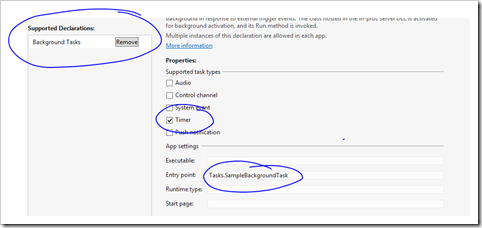

I'm just coming to the end of another Windows 8 boot camp in London. I had a few interesting questions and so I thought I'd document some of them here. Remember if you want to come to one of our Windows 8 Camps then all of the dates and registration details can be found [here](http://www.microsoft.com/click/services/Redirect2.ashx?CR_CC=200113240).

# # How&#160; do I update my tile periodically

There are a few ways to do this, you could push tile updates down to the device using [push notifications](http://msdn.microsoft.com/en-us/library/windows/apps/xaml/Hh868252(v=win.10).aspx), you could update the tile from [the running app](http://msdn.microsoft.com/en-us/library/windows/apps/hh781199.aspx) or a [background process](http://msdn.microsoft.com/en-us/library/windows/apps/windows.applicationmodel.background.timetrigger.timetrigger(v=VS.85).aspx) or you could have the TileManager poll a URL for an update at specific intervals.

# # How do I Poll a URL to update my tile in C#

To poll a URL we first need to get a reference to the Tile Update Manager. If we want to add more than one tile we need to set EnableNotificationQueue to true. 

We then set up a variable called recurrence and in this sample we set it to half a hour. This is the the fastest that we can set this to run you could also run it every hour, six hours, twelve hours or each day.
  <pre class="csharpcode">var tileUpdater = TileUpdateManager.CreateTileUpdaterForApplication();
tileUpdater.EnableNotificationQueue(true);
PeriodicUpdateRecurrence recurrence = PeriodicUpdateRecurrence.HalfHour;
var uriList = new List<Uri>{
new Uri("http://lab.thebeebs.co.uk/notifications/tile.xml")};
tileUpdater.StartPeriodicUpdateBatch(uriList, recurrence);</pre>

&#160;

In the urlList above I have added just one URL but you could provide up to five and the tile Update Manager would cycle through them.

The URL that you point the updater to should return some XML. You can provide a different style for a small and a wide tile, however, you cannot provide multiple wide or multiple small templates in a single file.

In the example below I used TileSquareText04 and TileWideText03 template, but there are many [other templates](http://msdn.microsoft.com/en-us/library/windows/apps/xaml/hh868263.aspx) you could use.

<pre class="csharpcode"><tile>
  <visual>
    <binding template="TileSquareText04">
      <text id="1">SquareText04 - 01</text>
    </binding>    
    <binding template="TileWideText03">
      <text id="1">WideText03 - 01</text>
    </binding>    
  </visual>
</tile></pre>

<pre class="csharpcode"></pre>

# # How do I add a Background Process that will update my tile periodically

To add a background process you must first declare it in your app manifest file by adding Background Tasks as a supported Declaration, Ticking Timer and then adding the Entry point. The entry point should point to a class inherits from IBackgroundTask. 

For&#160; Timer background tasks to work your app must be installed on the users lock screen. 

The entry point is the class in which you do you background work, so for the user I spoke to today this is where he would update his tile.

&#160;

On your app initialisation you then just need to register the task.

I registered the Task with the following code. I set up a Background Task Builder. You set the entry point as the background class that you want to preform the work, give the task a name and set a trigger. A trigger is the event that will occur that fires the background task. I set up a time Trigger and said is should run every 15 minutes.

I also set up a condition. If the condition is not met then the trigger will not fire. As my trigger required internet access I told the trigger to only fire if internet was available. Finally I register the Task.

<pre class="csharpcode">var builder = new BackgroundTaskBuilder();
builder.Name = "SampleBackgroundTask";
builder.TaskEntryPoint = "Tasks.SampleBackgroundTask";
builder.SetTrigger(new TimeTrigger(15, false));
var condition = Windows.ApplicationModel.Background.SystemConditionType.InternetAvailable;
var taskCondition = new Windows.ApplicationModel.Background.SystemCondition(condition);
builder.AddCondition(taskCondition);
BackgroundTaskRegistration task = builder.Register();</pre>

&#160;

The function builder.Register() returns a task. This is useful as you can add handlers in your main app for progress and completion. This allows you to update UI in your app if your application happens to be running.

<pre class="csharpcode">task.Progress += new BackgroundTaskProgressEventHandler(OnProgress);
task.Completed += new BackgroundTaskCompletedEventHandler(OnCompleted);</pre>

<pre class="csharpcode">&#160;</pre>

# # How do I ask the user to add my application to the lock screen

For background task with timers to launch you must ensure that your app is added to the lock screen. You can request to be added as a lock screen application by adding the following code to your project:

<pre class="csharpcode">var backManager = await Windows.ApplicationModel.Background.BackgroundExecutionManager.RequestAccessAsync();

switch (backManager)
{
    case BackgroundAccessStatus.AllowedMayUseActiveRealTimeConnectivity:
        break;
    case BackgroundAccessStatus.AllowedWithAlwaysOnRealTimeConnectivity:
        break;
    case BackgroundAccessStatus.Denied:
        break;
    case BackgroundAccessStatus.Unspecified:
        break;
    default:
        break;
}</pre>

You can also check to see if your app is a lock screen app by using the following code:

<pre class="csharpcode">var status = Windows.ApplicationModel.Background.BackgroundExecutionManager.GetAccessStatus();
switch (status)
{
    case BackgroundAccessStatus.AllowedMayUseActiveRealTimeConnectivity:
        break;
    case BackgroundAccessStatus.AllowedWithAlwaysOnRealTimeConnectivity:
        break;
    case BackgroundAccessStatus.Denied:
        break;
    case BackgroundAccessStatus.Unspecified:
        break;
    default:
        break;
}</pre>
Those were just a selection of the questions asked today. If you have any questions make sure you visit the forums on [http://dev.windows.com](http://dev.windows.com) and if you want to come along to one of the camps and get in person help, advise or just learn to build apps in JavaScript or C# then make sure you register on [our site](http://www.microsoft.com/click/services/Redirect2.ashx?CR_CC=200113240) for a camp near you.