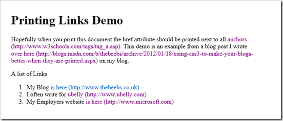

I recently walked past someone in the office who was reading a web article that they'd printed off. Now putting to one-side the environmental impact of printing the internet there is also another disadvantage to reading printed webpages... the hyperlinks don't work. Wouldn't it be nice if you could somehow add the textual link next to a hyperlink but only when a document was printed, well you can using CSS [:after](http://www.w3schools.com/cssref/sel_after.asp) selector.

[Demo view here ](http://lab.thebeebs.co.uk/printingLinks/)

Firstly you will need to add a print style sheet. This is just a regular stylesheet which is only applied when the document is being printed. This requires a regular style sheet link with the attribute media="print".
  
<pre class="brush: html;"><link href="print.css" rel="stylesheet" type="text/css" media="print" /></pre>

Inside this style you just need to the following CSS. I tend to switch text decoration (the underlining) off of printed hyperlinks because it's easier to see URL when they are printed without the underlining (but this is entirely optional and there are reasons why you might not want to do this)

<pre class="brush: html;">a:after
{
    content: " (" attr(href) ")";
}
a
{
    text-decoration: none;
}
</pre>

The [demo page](http://lab.thebeebs.co.uk/printingLinks/) will then look like the below image when it is printed:

If you would rather use [inline style](http://lab.thebeebs.co.uk/printingLinks/inline.html) then you could write it like this:

<pre class="brush: html;"></pre>
