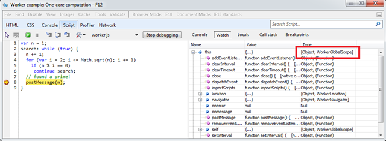

[ So cogs will have to do.")](https://msdnshared.blob.core.windows.net/media/MSDNBlogsFS/prod.evol.blogs.msdn.com/CommunityServer.Blogs.Components.WeblogFiles/00/00/01/38/93/metablogapi/8787.image_777E4147.png)[Web Workers](http://www.w3.org/TR/workers/) are a technology that give you a way of supporting long running or complex JavaScript functions without interrupting the general browsing experience. In short, Web Workers give developers an opportunity to create applications in JavaScript that would have previously been impossible.

When I talk about Web Workers at events the number one comment I get is "Well I just can't think of a real use for them". It's a fair point , developers have been conditioned over many years to keep JavaScript development simple and to avoid complexity because browsers can't handle it. This aversion to "the complex" means that scenarios that could utilise Web Workers are often dismissed before they are even considered.

In fairness this restriction still exists, websites will for a long time yet will have to support browsers that don't have Web Workers. It might not even be an option to progressively enhance because scenarios that call for Web Workers may not be able to be recreated in browsers that don't natively support them.

My rebuttal is: just because browser support isn't universal, it does not make a technology irrelevant. Now is the time for developers to start learning and applying Web Workers in development environments and to figure out if they can provide competitive advantage in the future. The only way you can discover potential real world scenarios for usage is by playing, experimenting and iterating.

Web Workers do, however, pose a challenge: they have been [notoriously difficult to debug](http://www.nczonline.net/blog/2009/08/25/web-workers-errors-and-debugging/). IE10 Platform Preview 2 showcases a new way to debug Web Workers by using the standard F12 Developer Tools. Up until now it's been necessary to rely on Awkward simulated environments but these new tools allow you to interact with the actual workers directly from the tools. You can add breakpoints, add watches and interrogate the WorkerGlobalScope.

Web workers are often cited as being really useful for gaming scenarios, but if you have come across other potential uses it would be great if you could share them in the comments below.