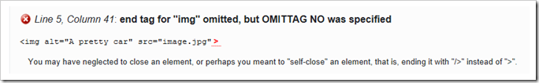

HTML5 is a much more forgiving when it comes to Mark-up than XHTML. With XHTML you needed to make sure that each opening HTML tag had it's own closing tag. So you would always close an image tag like this:
  
<pre class="brush: html;"></pre>

If you forgot to close the tag, like this:

<pre class="brush: html;"></pre>

And you tried to validate the document then you would end up with an error like this:

However, try the same thing with the [W3C HTML5](http://validator.w3.org) validator and you will discover that it' doesn't have an issue with it.

The HTML5 specification has standardised the way that browsers deal with the problem of malformed HTML5 so you don't need to worry about it... unless of course you want to. You see, you can use XHTML5 which insists that every tag must be explicitly closed ([amongst other things](http://dev.w3.org/html5/spec/Overview.html#html-vs-xhtml)). In short the issue of people not correctly closing tags was so widespread that it was considered a better approach for all the browser manufacturers to agree on how they should deal with such issues rather than fighting an up hill battle to convince everyone to write XML based mark-up.

For what it is worth, I continue to close tags even though I don't need to... it makes makes the OCD side of my personality happy. 