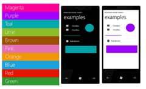

I was putting together a WP7 presentation recently. I needed to use all of the WP7 colours as background for the slides. It took me a while to collate all of the colours so I thought I'd post them up here in case anyone needed them.

&#160;&#160;&#160; 
  <table border="0" cellspacing="0" cellpadding="2" width="400"><tbody>     <tr>       <td valign="top" width="133">Magenta </td>        <td valign="top" width="133">#FF0094</td>        <td valign="top" width="133">RGB( 255, 0, 148)</td>     </tr>      <tr>       <td valign="top" width="133">Purple</td>        <td valign="top" width="133">#A500FF </td>        <td valign="top" width="133">RGB(165, 0, 255)</td>     </tr>      <tr>       <td valign="top" width="133">Teal</td>        <td valign="top" width="133">#00AAAD </td>        <td valign="top" width="133">RGB(0, 170, 173)</td>     </tr>      <tr>       <td valign="top" width="133">Lime </td>        <td valign="top" width="133">#8CBE29 </td>        <td valign="top" width="133">RGB(140, 190, 41)</td>     </tr>      <tr>       <td valign="top" width="133">Brown </td>        <td valign="top" width="133">#9C5100</td>        <td valign="top" width="133">RGB(156, 81, 0)</td>     </tr>      <tr>       <td valign="top" width="133">Pink </td>        <td valign="top" width="133">#E671B5 </td>        <td valign="top" width="133">RGB(230, 113, 181)</td>     </tr>      <tr>       <td valign="top" width="133">Orange </td>        <td valign="top" width="133">#EF9608</td>        <td valign="top" width="133">RGB(239, 150, 8)</td>     </tr>      <tr>       <td valign="top" width="133">Blue </td>        <td valign="top" width="133">#19A2DE </td>        <td valign="top" width="133">RGB(25, 162, 222)</td>     </tr>      <tr>       <td valign="top" width="133">Red </td>        <td valign="top" width="133">#E61400 </td>        <td valign="top" width="133">RGB(230, 20, 0)</td>     </tr>      <tr>       <td valign="top" width="133">Green </td>        <td valign="top" width="133">#319A31 </td>        <td valign="top" width="133">RGB(49, 154, 49)</td>     </tr>   </tbody></table>